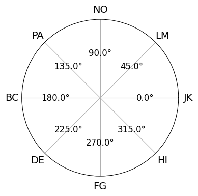
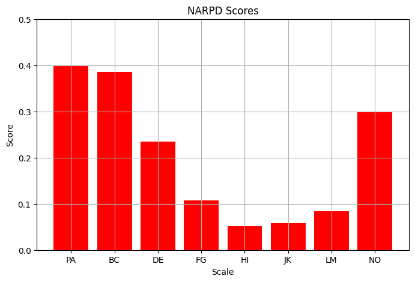
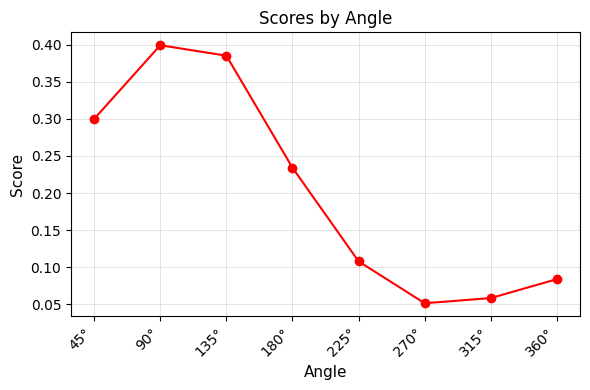
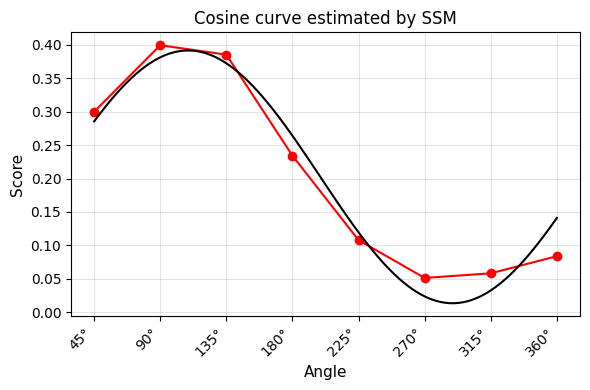
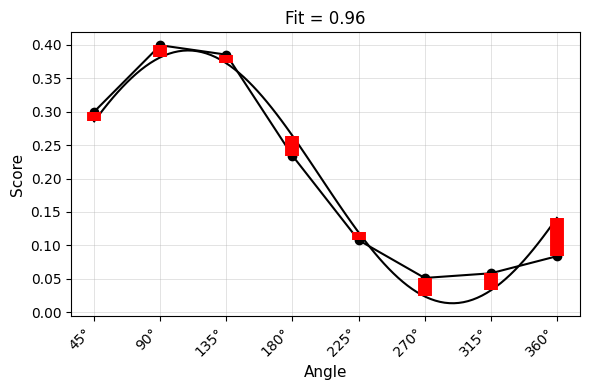
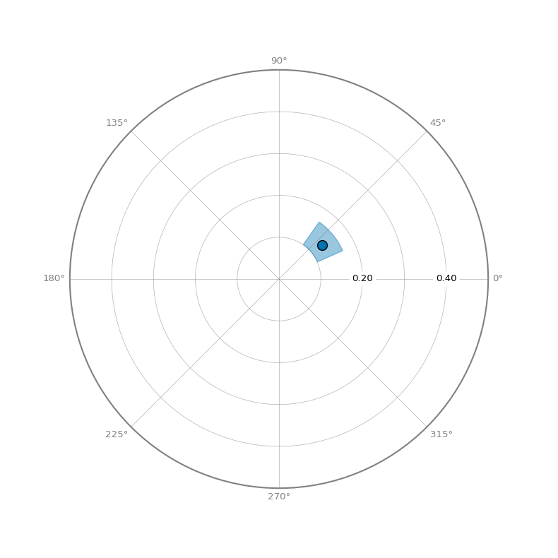

# Introduction to SSM Analysis


Reproduced from the introductory vignette for [R
Circumplex](https://circumplex.jmgirard.com/articles/introduction-to-ssm-analysis.html),
by Girard J, Zimmermann J, Wright A (2023). circumplex: Analysis and
Visualization of Circular Data. https://github.com/jmgirard/circumplex,
http://circumplex.jmgirard.com/.

If you find this tutorial useful, **please cite Girard, Zimmermann, &
Wright (2023)**. I am reproducing it here to demonstrate the equivalence
between the R and Python versions of the package. The original R version
of this vignette can be found
[here](https://circumplex.jmgirard.com/articles/introduction-to-ssm-analysis.html).

``` python
import matplotlib.pyplot as plt
import numpy as np
from great_tables import GT

import circumplex
from circumplex import OCTANTS, get_instrument, load_dataset, octants

# %matplotlib inline
degree_sign = "\N{DEGREE SIGN}"
```

## 1. Background and Motivation

### Circumplex models, scales, and data

Circumplex models are popular within many areas of psychology because
they offer a parsimonious account of complex psychological domains, such
as emotion and interpersonal functioning. This parsimony is achieved by
understanding phenomena in a domain as being a “blend” of two primary
dimensions. For instance, circumplex models of emotion typically
represent affective phenomena as a blend of *valence* (pleasantness
versus unpleasantness) and *arousal* (activity versus passivity),
whereas circumplex models of interpersonal functioning typically
represent interpersonal phenomena as a blend of *communion* (affiliation
versus separation) and *agency* (dominance versus submissiveness). These
models are often depicted as circles around the intersection of the two
dimensions (see figure). Any given phenomenon can be located within this
circular space through reference to the two underlying dimensions
(e.g. anger is a blend of unpleasantness and activity).

Circumplex scales contain multiple subscales that attempt to measure
different blends of the two primary dimensions (i.e., different parts of
the circle). Although there have historically been circumplex scales
with as many as sixteen subscales, it has become most common to use
eight subscales: one for each “pole” of the two primary dimensions and
one for each “quadrant” that combines the two dimensions. In order for a
set of subscales to be considered circumplex, they must exhibit certain
properties. Circumplex fit analyses can be used to quantify these
properties.

Circumplex data is composed of scores on a set of circumplex scales for
one or more participants (e.g., persons or organizations). Such data is
usually collected via self-report, informant-report, or observational
ratings in order to locate psychological phenomena within the circular
space of the circumplex model. For example, a therapist might want to
understand the interpersonal problems encountered by an individual
patient, a social psychologist might want to understand the emotional
experiences of a group of participants during an experiment, and a
personality psychologist might want to understand what kind of
interpersonal behaviors are associated with a trait (e.g.,
extraversion).

``` python
angles = octants(3)
alabel = ("PA", "BC", "DE", "FG", "HI", "JK", "LM", "NO")

# Create plot ---------------------------------------------------------------

fig, ax = plt.subplots(figsize=(4, 4), subplot_kw={"polar": True})

ax.plot()
ax.set_xticks(np.radians(angles), labels=alabel, fontsize=14)
ax.set_yticks([])
ax.grid(visible=True)
for angle in angles:
    ax.text(
        np.radians(angle),
        0.6,
        f"{angle}{degree_sign}",
        ha="center",
        va="center",
        fontsize=12,
    )
plt.show()
```



### The Structural Summary Method

The Structural Summary Method (SSM) is a technique for analyzing
circumplex data that offers practical and interpretive benefits over
alternative techniques. It consists of fitting a cosine curve to the
data, which captures the pattern of correlations among scores associated
with a circumplex scale (i.e., mean scores on circumplex scales or
correlations between circumplex scales and an external measure). By
plotting a set of example scores below, we can gain a visual intuition
that a cosine curve makes sense in this case. First, we can examine the
scores with a bar chart ignoring the circular relationship among them.

``` python
scales = ["PA", "BC", "DE", "FG", "HI", "JK", "LM", "NO"]

jz_data = load_dataset("jz2017")
r = circumplex.ssm_analyze(jz_data, scales, angles=OCTANTS, measures=["NARPD"])
plt.figure(figsize=(8, 5))
plt.bar(scales, r.scores[scales].to_numpy()[0], color="red")
plt.ylim(0, 0.5)
plt.ylabel("Score")
plt.xlabel("Scale")
plt.title("NARPD Scores")
plt.grid(visible=True)
plt.show()
```



Next, we can leverage the fact that these subscales have specific
angular displacements in the circumplex model (and that 0 and 360
degrees are the same) to create a path diagram.

``` python
fig = r.plot_curve(incl_pred=False)

plt.xlabel("Angle")
plt.title("Scores by Angle")
plt.show()
```



This already looks like a cosine curve, and we can finally use the SSM
to estimate the parameters of the curve that best fits the observed
data. By plotting it alongside the data, we can get a sense of how well
the model fits our example data.

``` python
fig = r.plot_curve()

plt.xlabel("Angle")
plt.title("Cosine curve estimated by SSM")
plt.show()
```



## Understanding the SSM Parameters

The SSM estimates a cosine curve to the data using the following
equation:

*S*<sub>*i*</sub> = *e* + *a* × cos (*θ*<sub>*i*</sub> − *d*)

where *S*<sub>*i*</sub> and *θ*<sub>*i*</sub> are the score and angle on
scale *i*, respectively, and *e*, *a*, and *d* are the elevation,
amplitude, and displacement of the curve, respectively. Before we
discuss these parameters, however, we can also estimate the fit of the
SSM model. This is essentially how close the cosine curve is to the
observed data points.

``` python
import numpy as np
from matplotlib import collections as mc

fig = r.plot_curve(c_fit="black", c_scores="black")
thetas = np.linspace(0, 360, 1000)
fit = circumplex.utils.cosine_form(
    np.deg2rad(thetas),
    r.results["a_est"][0],
    np.deg2rad(r.results["d_est"][0]),
    r.results["e_est"][0],
)
angles, scores = circumplex.utils.sort_angles(
    np.array(r.details.angles), r.scores[scales].to_numpy()[0]
)

lines = []
for i, angle in enumerate(angles):
    idx = np.where(np.isclose(thetas, angle, atol=0.2))[0][-1]
    lines.append([(angle, fit[idx]), (angle, scores[i])])
    if angle == 360:
        lines.append([(0, fit[0]), (0, scores[i])])

lc = mc.LineCollection(lines, colors="red", linewidths=10)
fig.axes[0].add_collection(lc)

plt.xlabel("Angle")
plt.title(f"Fit = {round(r.results.fit_est[0], 2)}")
plt.show()
```



If fit is less than 0.70, it is considered “unacceptable” and only the
elevation parameter should be interpreted. If fit is between 0.70 and
0.80, it is considered “adequate”, and if it is greater than 0.80, it is
considered “good”. Sometimes SSM model fit is called prototypicality or
denoted using *R*<sup>2</sup>.

The first SSM parameter is elevation or *e*, which is calculated as the
mean of all scores. It is the size of the general factor in the
circumplex model and its interpretation varies from scale to scale. For
measures of interpersonal problems, it is interpreted as generalized
interpersonal distress. When using correlation-based SSM, |*e*| ≥ 0.15
is considered “marked” and |*e*| ≤ .15 is considered “modest”.

The second SSM is amplitude or *a*, which is calculated as the
difference between the highest point of the curve and the curve’s mean.
It is interpreted as the distinctiveness or differentiation of a
profile: how much it is peaked versus flat. Similar to elevation, when
using correlation based SSM, *a* ≥ 0.15 is considered “marked” and
*a* ≤ 0.15 is considered “modest”.

The final SSM parameter is displacement or *d*, which is calculated as
the angle at which the curve reaches its highest point. It is
interpreted as the style of the profile. For instance, if *d* = 90 and
we are using a circumplex scale that defines 90 degrees as
“domineering”, then the profile’s style is domineering.

By interpreting these three parameters, we can understand a profile much
more parsimoniously than by trying to interpret all eight subscales
individually. This approach also leverages the circumplex relationship
(i.e. dependency) among subscales. It is also possible to transform the
amplitude and displacement parameters into estimates of distance from
the x-axis and y-axis, which will be shown in the output discussed
below.

## Example Data: jz2017

To illustrate the SSM functions, we will use the example dataset
`JZ2017`, which was provided by Zimmerman & Wright (2017). This dataset
includes self-report data from 1166 undergraduate students. Students
completed a circumplex measure of interpersonal problems with eight
subscales (PA, BC, DE, FG, HI, JK, LM, and NO) and a measure of
personality disorder symptoms with ten subscales (PARPD, SCZPD, SZTPD,
ASPD, BORPD, HISPD, NARPD, AVPD, DPNPD, and OCPD). More information
about these variables can be accessed by looking at the summary of the
dataset with `jz_data.summary()`:

``` python
iipsc = get_instrument("iipsc")
iipsc
```

    IIP-SC: Inventory of Interpersonal Problems Short Circumplex
    32 items, 8 scales, 2 normative data sets
    Soldz, Budman, Demby, & Merry (1995)
    < https://doi.org/10.1177/1073191195002001006 >

And we can view the accompanying dataset with:

``` python
jz2017 = load_dataset("jz2017")
GT(jz2017.head())
```

<div id="wpdpnhkomk" style="padding-left:0px;padding-right:0px;padding-top:10px;padding-bottom:10px;overflow-x:auto;overflow-y:auto;width:auto;height:auto;">
<style>
#wpdpnhkomk table {
          font-family: -apple-system, BlinkMacSystemFont, 'Segoe UI', Roboto, Oxygen, Ubuntu, Cantarell, 'Helvetica Neue', 'Fira Sans', 'Droid Sans', Arial, sans-serif;
          -webkit-font-smoothing: antialiased;
          -moz-osx-font-smoothing: grayscale;
        }

#wpdpnhkomk thead, tbody, tfoot, tr, td, th { border-style: none !important; }
 tr { background-color: transparent !important; }
#wpdpnhkomk p { margin: 0 !important; padding: 0 !important; }
 #wpdpnhkomk .gt_table { display: table !important; border-collapse: collapse !important; line-height: normal !important; margin-left: auto !important; margin-right: auto !important; color: #333333 !important; font-size: 16px !important; font-weight: normal !important; font-style: normal !important; background-color: #FFFFFF !important; width: auto !important; border-top-style: solid !important; border-top-width: 2px !important; border-top-color: #A8A8A8 !important; border-right-style: none !important; border-right-width: 2px !important; border-right-color: #D3D3D3 !important; border-bottom-style: solid !important; border-bottom-width: 2px !important; border-bottom-color: #A8A8A8 !important; border-left-style: none !important; border-left-width: 2px !important; border-left-color: #D3D3D3 !important; }
 #wpdpnhkomk .gt_caption { padding-top: 4px !important; padding-bottom: 4px !important; }
 #wpdpnhkomk .gt_title { color: #333333 !important; font-size: 125% !important; font-weight: initial !important; padding-top: 4px !important; padding-bottom: 4px !important; padding-left: 5px !important; padding-right: 5px !important; border-bottom-color: #FFFFFF !important; border-bottom-width: 0 !important; }
 #wpdpnhkomk .gt_subtitle { color: #333333 !important; font-size: 85% !important; font-weight: initial !important; padding-top: 3px !important; padding-bottom: 5px !important; padding-left: 5px !important; padding-right: 5px !important; border-top-color: #FFFFFF !important; border-top-width: 0 !important; }
 #wpdpnhkomk .gt_heading { background-color: #FFFFFF !important; text-align: center !important; border-bottom-color: #FFFFFF !important; border-left-style: none !important; border-left-width: 1px !important; border-left-color: #D3D3D3 !important; border-right-style: none !important; border-right-width: 1px !important; border-right-color: #D3D3D3 !important; }
 #wpdpnhkomk .gt_bottom_border { border-bottom-style: solid !important; border-bottom-width: 2px !important; border-bottom-color: #D3D3D3 !important; }
 #wpdpnhkomk .gt_col_headings { border-top-style: solid !important; border-top-width: 2px !important; border-top-color: #D3D3D3 !important; border-bottom-style: solid !important; border-bottom-width: 2px !important; border-bottom-color: #D3D3D3 !important; border-left-style: none !important; border-left-width: 1px !important; border-left-color: #D3D3D3 !important; border-right-style: none !important; border-right-width: 1px !important; border-right-color: #D3D3D3 !important; }
 #wpdpnhkomk .gt_col_heading { color: #333333 !important; background-color: #FFFFFF !important; font-size: 100% !important; font-weight: normal !important; text-transform: inherit !important; border-left-style: none !important; border-left-width: 1px !important; border-left-color: #D3D3D3 !important; border-right-style: none !important; border-right-width: 1px !important; border-right-color: #D3D3D3 !important; vertical-align: bottom !important; padding-top: 5px !important; padding-bottom: 5px !important; padding-left: 5px !important; padding-right: 5px !important; overflow-x: hidden !important; }
 #wpdpnhkomk .gt_column_spanner_outer { color: #333333 !important; background-color: #FFFFFF !important; font-size: 100% !important; font-weight: normal !important; text-transform: inherit !important; padding-top: 0 !important; padding-bottom: 0 !important; padding-left: 4px !important; padding-right: 4px !important; }
 #wpdpnhkomk .gt_column_spanner_outer:first-child { padding-left: 0 !important; }
 #wpdpnhkomk .gt_column_spanner_outer:last-child { padding-right: 0 !important; }
 #wpdpnhkomk .gt_column_spanner { border-bottom-style: solid !important; border-bottom-width: 2px !important; border-bottom-color: #D3D3D3 !important; vertical-align: bottom !important; padding-top: 5px !important; padding-bottom: 5px !important; overflow-x: hidden !important; display: inline-block !important; width: 100% !important; }
 #wpdpnhkomk .gt_spanner_row { border-bottom-style: hidden !important; }
 #wpdpnhkomk .gt_group_heading { padding-top: 8px !important; padding-bottom: 8px !important; padding-left: 5px !important; padding-right: 5px !important; color: #333333 !important; background-color: #FFFFFF !important; font-size: 100% !important; font-weight: initial !important; text-transform: inherit !important; border-top-style: solid !important; border-top-width: 2px !important; border-top-color: #D3D3D3 !important; border-bottom-style: solid !important; border-bottom-width: 2px !important; border-bottom-color: #D3D3D3 !important; border-left-style: none !important; border-left-width: 1px !important; border-left-color: #D3D3D3 !important; border-right-style: none !important; border-right-width: 1px !important; border-right-color: #D3D3D3 !important; vertical-align: middle !important; text-align: left !important; }
 #wpdpnhkomk .gt_empty_group_heading { padding: 0.5px !important; color: #333333 !important; background-color: #FFFFFF !important; font-size: 100% !important; font-weight: initial !important; border-top-style: solid !important; border-top-width: 2px !important; border-top-color: #D3D3D3 !important; border-bottom-style: solid !important; border-bottom-width: 2px !important; border-bottom-color: #D3D3D3 !important; vertical-align: middle !important; }
 #wpdpnhkomk .gt_from_md> :first-child { margin-top: 0 !important; }
 #wpdpnhkomk .gt_from_md> :last-child { margin-bottom: 0 !important; }
 #wpdpnhkomk .gt_row { padding-top: 8px !important; padding-bottom: 8px !important; padding-left: 5px !important; padding-right: 5px !important; margin: 10px !important; border-top-style: solid !important; border-top-width: 1px !important; border-top-color: #D3D3D3 !important; border-left-style: none !important; border-left-width: 1px !important; border-left-color: #D3D3D3 !important; border-right-style: none !important; border-right-width: 1px !important; border-right-color: #D3D3D3 !important; vertical-align: middle !important; overflow-x: hidden !important; }
 #wpdpnhkomk .gt_stub { color: #333333 !important; background-color: #FFFFFF !important; font-size: 100% !important; font-weight: initial !important; text-transform: inherit !important; border-right-style: solid !important; border-right-width: 2px !important; border-right-color: #D3D3D3 !important; padding-left: 5px !important; padding-right: 5px !important; }
 #wpdpnhkomk .gt_stub_row_group { color: #333333 !important; background-color: #FFFFFF !important; font-size: 100% !important; font-weight: initial !important; text-transform: inherit !important; border-right-style: solid !important; border-right-width: 2px !important; border-right-color: #D3D3D3 !important; padding-left: 5px !important; padding-right: 5px !important; vertical-align: top !important; }
 #wpdpnhkomk .gt_row_group_first td { border-top-width: 2px !important; }
 #wpdpnhkomk .gt_row_group_first th { border-top-width: 2px !important; }
 #wpdpnhkomk .gt_striped { color: #333333 !important; background-color: #F4F4F4 !important; }
 #wpdpnhkomk .gt_table_body { border-top-style: solid !important; border-top-width: 2px !important; border-top-color: #D3D3D3 !important; border-bottom-style: solid !important; border-bottom-width: 2px !important; border-bottom-color: #D3D3D3 !important; }
 #wpdpnhkomk .gt_grand_summary_row { color: #333333 !important; background-color: #FFFFFF !important; text-transform: inherit !important; padding-top: 8px !important; padding-bottom: 8px !important; padding-left: 5px !important; padding-right: 5px !important; }
 #wpdpnhkomk .gt_first_grand_summary_row_bottom { border-top-style: double !important; border-top-width: 6px !important; border-top-color: #D3D3D3 !important; }
 #wpdpnhkomk .gt_last_grand_summary_row_top { border-bottom-style: double !important; border-bottom-width: 6px !important; border-bottom-color: #D3D3D3 !important; }
 #wpdpnhkomk .gt_sourcenotes { color: #333333 !important; background-color: #FFFFFF !important; border-bottom-style: none !important; border-bottom-width: 2px !important; border-bottom-color: #D3D3D3 !important; border-left-style: none !important; border-left-width: 2px !important; border-left-color: #D3D3D3 !important; border-right-style: none !important; border-right-width: 2px !important; border-right-color: #D3D3D3 !important; }
 #wpdpnhkomk .gt_sourcenote { font-size: 90% !important; padding-top: 4px !important; padding-bottom: 4px !important; padding-left: 5px !important; padding-right: 5px !important; text-align: left !important; }
 #wpdpnhkomk .gt_left { text-align: left !important; }
 #wpdpnhkomk .gt_center { text-align: center !important; }
 #wpdpnhkomk .gt_right { text-align: right !important; font-variant-numeric: tabular-nums !important; }
 #wpdpnhkomk .gt_font_normal { font-weight: normal !important; }
 #wpdpnhkomk .gt_font_bold { font-weight: bold !important; }
 #wpdpnhkomk .gt_font_italic { font-style: italic !important; }
 #wpdpnhkomk .gt_super { font-size: 65% !important; }
 #wpdpnhkomk .gt_footnote_marks { font-size: 75% !important; vertical-align: 0.4em !important; position: initial !important; }
 #wpdpnhkomk .gt_asterisk { font-size: 100% !important; vertical-align: 0 !important; }

</style>

<table class="gt_table" data-quarto-postprocess="true"
data-quarto-disable-processing="false" data-quarto-bootstrap="false">
<thead>
<tr class="gt_col_headings">
<th id="Gender" class="gt_col_heading gt_columns_bottom_border gt_left"
data-quarto-table-cell-role="th" scope="col">Gender</th>
<th id="PA" class="gt_col_heading gt_columns_bottom_border gt_right"
data-quarto-table-cell-role="th" scope="col">PA</th>
<th id="BC" class="gt_col_heading gt_columns_bottom_border gt_right"
data-quarto-table-cell-role="th" scope="col">BC</th>
<th id="DE" class="gt_col_heading gt_columns_bottom_border gt_right"
data-quarto-table-cell-role="th" scope="col">DE</th>
<th id="FG" class="gt_col_heading gt_columns_bottom_border gt_right"
data-quarto-table-cell-role="th" scope="col">FG</th>
<th id="HI" class="gt_col_heading gt_columns_bottom_border gt_right"
data-quarto-table-cell-role="th" scope="col">HI</th>
<th id="JK" class="gt_col_heading gt_columns_bottom_border gt_right"
data-quarto-table-cell-role="th" scope="col">JK</th>
<th id="LM" class="gt_col_heading gt_columns_bottom_border gt_right"
data-quarto-table-cell-role="th" scope="col">LM</th>
<th id="NO" class="gt_col_heading gt_columns_bottom_border gt_right"
data-quarto-table-cell-role="th" scope="col">NO</th>
<th id="PARPD" class="gt_col_heading gt_columns_bottom_border gt_right"
data-quarto-table-cell-role="th" scope="col">PARPD</th>
<th id="SCZPD" class="gt_col_heading gt_columns_bottom_border gt_right"
data-quarto-table-cell-role="th" scope="col">SCZPD</th>
<th id="SZTPD" class="gt_col_heading gt_columns_bottom_border gt_right"
data-quarto-table-cell-role="th" scope="col">SZTPD</th>
<th id="ASPD" class="gt_col_heading gt_columns_bottom_border gt_right"
data-quarto-table-cell-role="th" scope="col">ASPD</th>
<th id="BORPD" class="gt_col_heading gt_columns_bottom_border gt_right"
data-quarto-table-cell-role="th" scope="col">BORPD</th>
<th id="HISPD" class="gt_col_heading gt_columns_bottom_border gt_right"
data-quarto-table-cell-role="th" scope="col">HISPD</th>
<th id="NARPD" class="gt_col_heading gt_columns_bottom_border gt_right"
data-quarto-table-cell-role="th" scope="col">NARPD</th>
<th id="AVPD" class="gt_col_heading gt_columns_bottom_border gt_right"
data-quarto-table-cell-role="th" scope="col">AVPD</th>
<th id="DPNPD" class="gt_col_heading gt_columns_bottom_border gt_right"
data-quarto-table-cell-role="th" scope="col">DPNPD</th>
<th id="OCPD" class="gt_col_heading gt_columns_bottom_border gt_right"
data-quarto-table-cell-role="th" scope="col">OCPD</th>
</tr>
</thead>
<tbody class="gt_table_body">
<tr>
<td class="gt_row gt_left">Female</td>
<td class="gt_row gt_right">1.5</td>
<td class="gt_row gt_right">1.5</td>
<td class="gt_row gt_right">1.25</td>
<td class="gt_row gt_right">1.0</td>
<td class="gt_row gt_right">2.0</td>
<td class="gt_row gt_right">2.5</td>
<td class="gt_row gt_right">2.25</td>
<td class="gt_row gt_right">2.5</td>
<td class="gt_row gt_right">4</td>
<td class="gt_row gt_right">3</td>
<td class="gt_row gt_right">7</td>
<td class="gt_row gt_right">7</td>
<td class="gt_row gt_right">8</td>
<td class="gt_row gt_right">4</td>
<td class="gt_row gt_right">6</td>
<td class="gt_row gt_right">3</td>
<td class="gt_row gt_right">4</td>
<td class="gt_row gt_right">6</td>
</tr>
<tr>
<td class="gt_row gt_left">Female</td>
<td class="gt_row gt_right">0.0</td>
<td class="gt_row gt_right">0.25</td>
<td class="gt_row gt_right">0.0</td>
<td class="gt_row gt_right">0.25</td>
<td class="gt_row gt_right">1.25</td>
<td class="gt_row gt_right">1.75</td>
<td class="gt_row gt_right">2.25</td>
<td class="gt_row gt_right">2.25</td>
<td class="gt_row gt_right">1</td>
<td class="gt_row gt_right">0</td>
<td class="gt_row gt_right">2</td>
<td class="gt_row gt_right">0</td>
<td class="gt_row gt_right">1</td>
<td class="gt_row gt_right">2</td>
<td class="gt_row gt_right">3</td>
<td class="gt_row gt_right">0</td>
<td class="gt_row gt_right">1</td>
<td class="gt_row gt_right">0</td>
</tr>
<tr>
<td class="gt_row gt_left">Female</td>
<td class="gt_row gt_right">0.0</td>
<td class="gt_row gt_right">0.0</td>
<td class="gt_row gt_right">0.0</td>
<td class="gt_row gt_right">0.0</td>
<td class="gt_row gt_right">0.0</td>
<td class="gt_row gt_right">0.0</td>
<td class="gt_row gt_right">0.0</td>
<td class="gt_row gt_right">0.0</td>
<td class="gt_row gt_right">0</td>
<td class="gt_row gt_right">1</td>
<td class="gt_row gt_right">0</td>
<td class="gt_row gt_right">4</td>
<td class="gt_row gt_right">1</td>
<td class="gt_row gt_right">5</td>
<td class="gt_row gt_right">4</td>
<td class="gt_row gt_right">0</td>
<td class="gt_row gt_right">0</td>
<td class="gt_row gt_right">1</td>
</tr>
<tr>
<td class="gt_row gt_left">Male</td>
<td class="gt_row gt_right">2.0</td>
<td class="gt_row gt_right">1.75</td>
<td class="gt_row gt_right">1.75</td>
<td class="gt_row gt_right">2.5</td>
<td class="gt_row gt_right">2.0</td>
<td class="gt_row gt_right">1.75</td>
<td class="gt_row gt_right">2.0</td>
<td class="gt_row gt_right">2.5</td>
<td class="gt_row gt_right">1</td>
<td class="gt_row gt_right">0</td>
<td class="gt_row gt_right">0</td>
<td class="gt_row gt_right">0</td>
<td class="gt_row gt_right">1</td>
<td class="gt_row gt_right">0</td>
<td class="gt_row gt_right">0</td>
<td class="gt_row gt_right">0</td>
<td class="gt_row gt_right">0</td>
<td class="gt_row gt_right">0</td>
</tr>
<tr>
<td class="gt_row gt_left">Female</td>
<td class="gt_row gt_right">0.25</td>
<td class="gt_row gt_right">0.5</td>
<td class="gt_row gt_right">0.25</td>
<td class="gt_row gt_right">0.0</td>
<td class="gt_row gt_right">0.0</td>
<td class="gt_row gt_right">0.0</td>
<td class="gt_row gt_right">0.0</td>
<td class="gt_row gt_right">0.0</td>
<td class="gt_row gt_right">0</td>
<td class="gt_row gt_right">0</td>
<td class="gt_row gt_right">0</td>
<td class="gt_row gt_right">0</td>
<td class="gt_row gt_right">1</td>
<td class="gt_row gt_right">0</td>
<td class="gt_row gt_right">0</td>
<td class="gt_row gt_right">1</td>
<td class="gt_row gt_right">0</td>
<td class="gt_row gt_right">0</td>
</tr>
</tbody>
</table>

</div>

The circumplex scales in `JZ2017` come from the Inventory of
Interpersonal Problems - Short Circumplex (IIP-SC). These scales can be
arranged into the following circular model, which is organized around
the two primary dimensions of agency (y-axis) and communion (x-axis).
Note that the two-letter scale abbreviations and angular values are
based on convention. A high shore on PA indicates that one has
interpersonal problems related to being “domineering” or too high on
agency, whereas a high score on DE indicates problems related to being
“cold” or too low on communion. Scales that are not directly on the
y-axis or x-axis (i.e. BC, FG, JK, and NO) represent blends of agency
and communion.

## Mean-based SSM Analysis

### Conducting SSM for a group’s mean scores

To begin, let’s say that we want to use the SSM to describe the
interpersonal problems of the average individual in the entire dataset.
Although it is possible to analyze the raw scores contained in `jz2017`,
our results will be more interpretable if we standardize the scores
first. We can do this using the `standardize()` function.

The first argument to this function is `data`, a dataframe containing
the circumplex scales to be standardized. The second argment is `scales`
and specifies where in `data` the circumplex scales are (either in terms
of their variable names or their column numbers). The third argument is
`angles` and specifies the angle of each of the circumplex scales
included in `scales`. Note that the `scales` argument should be a
`circumplex.Scales` object and `angles` should be a `np.array` that have
the same ordering and length. Finally, the fourth argument is `norms`, a
dataframe containing the normative data we will use to standardize the
circumplex scales. Here, we will use normative data for the IIP-SC by
loading the `iipsc` instrument.

``` python
jz2017s = iipsc.norm_standardize(data=jz2017, sample_id=1)
GT(jz2017s.head().round(2))
```

<div id="noodsrdfow" style="padding-left:0px;padding-right:0px;padding-top:10px;padding-bottom:10px;overflow-x:auto;overflow-y:auto;width:auto;height:auto;">
<style>
#noodsrdfow table {
          font-family: -apple-system, BlinkMacSystemFont, 'Segoe UI', Roboto, Oxygen, Ubuntu, Cantarell, 'Helvetica Neue', 'Fira Sans', 'Droid Sans', Arial, sans-serif;
          -webkit-font-smoothing: antialiased;
          -moz-osx-font-smoothing: grayscale;
        }

#noodsrdfow thead, tbody, tfoot, tr, td, th { border-style: none !important; }
 tr { background-color: transparent !important; }
#noodsrdfow p { margin: 0 !important; padding: 0 !important; }
 #noodsrdfow .gt_table { display: table !important; border-collapse: collapse !important; line-height: normal !important; margin-left: auto !important; margin-right: auto !important; color: #333333 !important; font-size: 16px !important; font-weight: normal !important; font-style: normal !important; background-color: #FFFFFF !important; width: auto !important; border-top-style: solid !important; border-top-width: 2px !important; border-top-color: #A8A8A8 !important; border-right-style: none !important; border-right-width: 2px !important; border-right-color: #D3D3D3 !important; border-bottom-style: solid !important; border-bottom-width: 2px !important; border-bottom-color: #A8A8A8 !important; border-left-style: none !important; border-left-width: 2px !important; border-left-color: #D3D3D3 !important; }
 #noodsrdfow .gt_caption { padding-top: 4px !important; padding-bottom: 4px !important; }
 #noodsrdfow .gt_title { color: #333333 !important; font-size: 125% !important; font-weight: initial !important; padding-top: 4px !important; padding-bottom: 4px !important; padding-left: 5px !important; padding-right: 5px !important; border-bottom-color: #FFFFFF !important; border-bottom-width: 0 !important; }
 #noodsrdfow .gt_subtitle { color: #333333 !important; font-size: 85% !important; font-weight: initial !important; padding-top: 3px !important; padding-bottom: 5px !important; padding-left: 5px !important; padding-right: 5px !important; border-top-color: #FFFFFF !important; border-top-width: 0 !important; }
 #noodsrdfow .gt_heading { background-color: #FFFFFF !important; text-align: center !important; border-bottom-color: #FFFFFF !important; border-left-style: none !important; border-left-width: 1px !important; border-left-color: #D3D3D3 !important; border-right-style: none !important; border-right-width: 1px !important; border-right-color: #D3D3D3 !important; }
 #noodsrdfow .gt_bottom_border { border-bottom-style: solid !important; border-bottom-width: 2px !important; border-bottom-color: #D3D3D3 !important; }
 #noodsrdfow .gt_col_headings { border-top-style: solid !important; border-top-width: 2px !important; border-top-color: #D3D3D3 !important; border-bottom-style: solid !important; border-bottom-width: 2px !important; border-bottom-color: #D3D3D3 !important; border-left-style: none !important; border-left-width: 1px !important; border-left-color: #D3D3D3 !important; border-right-style: none !important; border-right-width: 1px !important; border-right-color: #D3D3D3 !important; }
 #noodsrdfow .gt_col_heading { color: #333333 !important; background-color: #FFFFFF !important; font-size: 100% !important; font-weight: normal !important; text-transform: inherit !important; border-left-style: none !important; border-left-width: 1px !important; border-left-color: #D3D3D3 !important; border-right-style: none !important; border-right-width: 1px !important; border-right-color: #D3D3D3 !important; vertical-align: bottom !important; padding-top: 5px !important; padding-bottom: 5px !important; padding-left: 5px !important; padding-right: 5px !important; overflow-x: hidden !important; }
 #noodsrdfow .gt_column_spanner_outer { color: #333333 !important; background-color: #FFFFFF !important; font-size: 100% !important; font-weight: normal !important; text-transform: inherit !important; padding-top: 0 !important; padding-bottom: 0 !important; padding-left: 4px !important; padding-right: 4px !important; }
 #noodsrdfow .gt_column_spanner_outer:first-child { padding-left: 0 !important; }
 #noodsrdfow .gt_column_spanner_outer:last-child { padding-right: 0 !important; }
 #noodsrdfow .gt_column_spanner { border-bottom-style: solid !important; border-bottom-width: 2px !important; border-bottom-color: #D3D3D3 !important; vertical-align: bottom !important; padding-top: 5px !important; padding-bottom: 5px !important; overflow-x: hidden !important; display: inline-block !important; width: 100% !important; }
 #noodsrdfow .gt_spanner_row { border-bottom-style: hidden !important; }
 #noodsrdfow .gt_group_heading { padding-top: 8px !important; padding-bottom: 8px !important; padding-left: 5px !important; padding-right: 5px !important; color: #333333 !important; background-color: #FFFFFF !important; font-size: 100% !important; font-weight: initial !important; text-transform: inherit !important; border-top-style: solid !important; border-top-width: 2px !important; border-top-color: #D3D3D3 !important; border-bottom-style: solid !important; border-bottom-width: 2px !important; border-bottom-color: #D3D3D3 !important; border-left-style: none !important; border-left-width: 1px !important; border-left-color: #D3D3D3 !important; border-right-style: none !important; border-right-width: 1px !important; border-right-color: #D3D3D3 !important; vertical-align: middle !important; text-align: left !important; }
 #noodsrdfow .gt_empty_group_heading { padding: 0.5px !important; color: #333333 !important; background-color: #FFFFFF !important; font-size: 100% !important; font-weight: initial !important; border-top-style: solid !important; border-top-width: 2px !important; border-top-color: #D3D3D3 !important; border-bottom-style: solid !important; border-bottom-width: 2px !important; border-bottom-color: #D3D3D3 !important; vertical-align: middle !important; }
 #noodsrdfow .gt_from_md> :first-child { margin-top: 0 !important; }
 #noodsrdfow .gt_from_md> :last-child { margin-bottom: 0 !important; }
 #noodsrdfow .gt_row { padding-top: 8px !important; padding-bottom: 8px !important; padding-left: 5px !important; padding-right: 5px !important; margin: 10px !important; border-top-style: solid !important; border-top-width: 1px !important; border-top-color: #D3D3D3 !important; border-left-style: none !important; border-left-width: 1px !important; border-left-color: #D3D3D3 !important; border-right-style: none !important; border-right-width: 1px !important; border-right-color: #D3D3D3 !important; vertical-align: middle !important; overflow-x: hidden !important; }
 #noodsrdfow .gt_stub { color: #333333 !important; background-color: #FFFFFF !important; font-size: 100% !important; font-weight: initial !important; text-transform: inherit !important; border-right-style: solid !important; border-right-width: 2px !important; border-right-color: #D3D3D3 !important; padding-left: 5px !important; padding-right: 5px !important; }
 #noodsrdfow .gt_stub_row_group { color: #333333 !important; background-color: #FFFFFF !important; font-size: 100% !important; font-weight: initial !important; text-transform: inherit !important; border-right-style: solid !important; border-right-width: 2px !important; border-right-color: #D3D3D3 !important; padding-left: 5px !important; padding-right: 5px !important; vertical-align: top !important; }
 #noodsrdfow .gt_row_group_first td { border-top-width: 2px !important; }
 #noodsrdfow .gt_row_group_first th { border-top-width: 2px !important; }
 #noodsrdfow .gt_striped { color: #333333 !important; background-color: #F4F4F4 !important; }
 #noodsrdfow .gt_table_body { border-top-style: solid !important; border-top-width: 2px !important; border-top-color: #D3D3D3 !important; border-bottom-style: solid !important; border-bottom-width: 2px !important; border-bottom-color: #D3D3D3 !important; }
 #noodsrdfow .gt_grand_summary_row { color: #333333 !important; background-color: #FFFFFF !important; text-transform: inherit !important; padding-top: 8px !important; padding-bottom: 8px !important; padding-left: 5px !important; padding-right: 5px !important; }
 #noodsrdfow .gt_first_grand_summary_row_bottom { border-top-style: double !important; border-top-width: 6px !important; border-top-color: #D3D3D3 !important; }
 #noodsrdfow .gt_last_grand_summary_row_top { border-bottom-style: double !important; border-bottom-width: 6px !important; border-bottom-color: #D3D3D3 !important; }
 #noodsrdfow .gt_sourcenotes { color: #333333 !important; background-color: #FFFFFF !important; border-bottom-style: none !important; border-bottom-width: 2px !important; border-bottom-color: #D3D3D3 !important; border-left-style: none !important; border-left-width: 2px !important; border-left-color: #D3D3D3 !important; border-right-style: none !important; border-right-width: 2px !important; border-right-color: #D3D3D3 !important; }
 #noodsrdfow .gt_sourcenote { font-size: 90% !important; padding-top: 4px !important; padding-bottom: 4px !important; padding-left: 5px !important; padding-right: 5px !important; text-align: left !important; }
 #noodsrdfow .gt_left { text-align: left !important; }
 #noodsrdfow .gt_center { text-align: center !important; }
 #noodsrdfow .gt_right { text-align: right !important; font-variant-numeric: tabular-nums !important; }
 #noodsrdfow .gt_font_normal { font-weight: normal !important; }
 #noodsrdfow .gt_font_bold { font-weight: bold !important; }
 #noodsrdfow .gt_font_italic { font-style: italic !important; }
 #noodsrdfow .gt_super { font-size: 65% !important; }
 #noodsrdfow .gt_footnote_marks { font-size: 75% !important; vertical-align: 0.4em !important; position: initial !important; }
 #noodsrdfow .gt_asterisk { font-size: 100% !important; vertical-align: 0 !important; }

</style>

<table class="gt_table" data-quarto-postprocess="true"
data-quarto-disable-processing="false" data-quarto-bootstrap="false">
<thead>
<tr class="gt_col_headings">
<th id="Gender" class="gt_col_heading gt_columns_bottom_border gt_left"
data-quarto-table-cell-role="th" scope="col">Gender</th>
<th id="PA" class="gt_col_heading gt_columns_bottom_border gt_right"
data-quarto-table-cell-role="th" scope="col">PA</th>
<th id="BC" class="gt_col_heading gt_columns_bottom_border gt_right"
data-quarto-table-cell-role="th" scope="col">BC</th>
<th id="DE" class="gt_col_heading gt_columns_bottom_border gt_right"
data-quarto-table-cell-role="th" scope="col">DE</th>
<th id="FG" class="gt_col_heading gt_columns_bottom_border gt_right"
data-quarto-table-cell-role="th" scope="col">FG</th>
<th id="HI" class="gt_col_heading gt_columns_bottom_border gt_right"
data-quarto-table-cell-role="th" scope="col">HI</th>
<th id="JK" class="gt_col_heading gt_columns_bottom_border gt_right"
data-quarto-table-cell-role="th" scope="col">JK</th>
<th id="LM" class="gt_col_heading gt_columns_bottom_border gt_right"
data-quarto-table-cell-role="th" scope="col">LM</th>
<th id="NO" class="gt_col_heading gt_columns_bottom_border gt_right"
data-quarto-table-cell-role="th" scope="col">NO</th>
<th id="PARPD" class="gt_col_heading gt_columns_bottom_border gt_right"
data-quarto-table-cell-role="th" scope="col">PARPD</th>
<th id="SCZPD" class="gt_col_heading gt_columns_bottom_border gt_right"
data-quarto-table-cell-role="th" scope="col">SCZPD</th>
<th id="SZTPD" class="gt_col_heading gt_columns_bottom_border gt_right"
data-quarto-table-cell-role="th" scope="col">SZTPD</th>
<th id="ASPD" class="gt_col_heading gt_columns_bottom_border gt_right"
data-quarto-table-cell-role="th" scope="col">ASPD</th>
<th id="BORPD" class="gt_col_heading gt_columns_bottom_border gt_right"
data-quarto-table-cell-role="th" scope="col">BORPD</th>
<th id="HISPD" class="gt_col_heading gt_columns_bottom_border gt_right"
data-quarto-table-cell-role="th" scope="col">HISPD</th>
<th id="NARPD" class="gt_col_heading gt_columns_bottom_border gt_right"
data-quarto-table-cell-role="th" scope="col">NARPD</th>
<th id="AVPD" class="gt_col_heading gt_columns_bottom_border gt_right"
data-quarto-table-cell-role="th" scope="col">AVPD</th>
<th id="DPNPD" class="gt_col_heading gt_columns_bottom_border gt_right"
data-quarto-table-cell-role="th" scope="col">DPNPD</th>
<th id="OCPD" class="gt_col_heading gt_columns_bottom_border gt_right"
data-quarto-table-cell-role="th" scope="col">OCPD</th>
<th id="PA_z" class="gt_col_heading gt_columns_bottom_border gt_right"
data-quarto-table-cell-role="th" scope="col">PA_z</th>
<th id="BC_z" class="gt_col_heading gt_columns_bottom_border gt_right"
data-quarto-table-cell-role="th" scope="col">BC_z</th>
<th id="DE_z" class="gt_col_heading gt_columns_bottom_border gt_right"
data-quarto-table-cell-role="th" scope="col">DE_z</th>
<th id="FG_z" class="gt_col_heading gt_columns_bottom_border gt_right"
data-quarto-table-cell-role="th" scope="col">FG_z</th>
<th id="HI_z" class="gt_col_heading gt_columns_bottom_border gt_right"
data-quarto-table-cell-role="th" scope="col">HI_z</th>
<th id="JK_z" class="gt_col_heading gt_columns_bottom_border gt_right"
data-quarto-table-cell-role="th" scope="col">JK_z</th>
<th id="LM_z" class="gt_col_heading gt_columns_bottom_border gt_right"
data-quarto-table-cell-role="th" scope="col">LM_z</th>
<th id="NO_z" class="gt_col_heading gt_columns_bottom_border gt_right"
data-quarto-table-cell-role="th" scope="col">NO_z</th>
</tr>
</thead>
<tbody class="gt_table_body">
<tr>
<td class="gt_row gt_left">Female</td>
<td class="gt_row gt_right">1.5</td>
<td class="gt_row gt_right">1.5</td>
<td class="gt_row gt_right">1.25</td>
<td class="gt_row gt_right">1.0</td>
<td class="gt_row gt_right">2.0</td>
<td class="gt_row gt_right">2.5</td>
<td class="gt_row gt_right">2.25</td>
<td class="gt_row gt_right">2.5</td>
<td class="gt_row gt_right">4</td>
<td class="gt_row gt_right">3</td>
<td class="gt_row gt_right">7</td>
<td class="gt_row gt_right">7</td>
<td class="gt_row gt_right">8</td>
<td class="gt_row gt_right">4</td>
<td class="gt_row gt_right">6</td>
<td class="gt_row gt_right">3</td>
<td class="gt_row gt_right">4</td>
<td class="gt_row gt_right">6</td>
<td class="gt_row gt_right">1.12</td>
<td class="gt_row gt_right">1.03</td>
<td class="gt_row gt_right">0.41</td>
<td class="gt_row gt_right">-0.05</td>
<td class="gt_row gt_right">0.63</td>
<td class="gt_row gt_right">1.31</td>
<td class="gt_row gt_right">0.95</td>
<td class="gt_row gt_right">1.84</td>
</tr>
<tr>
<td class="gt_row gt_left">Female</td>
<td class="gt_row gt_right">0.0</td>
<td class="gt_row gt_right">0.25</td>
<td class="gt_row gt_right">0.0</td>
<td class="gt_row gt_right">0.25</td>
<td class="gt_row gt_right">1.25</td>
<td class="gt_row gt_right">1.75</td>
<td class="gt_row gt_right">2.25</td>
<td class="gt_row gt_right">2.25</td>
<td class="gt_row gt_right">1</td>
<td class="gt_row gt_right">0</td>
<td class="gt_row gt_right">2</td>
<td class="gt_row gt_right">0</td>
<td class="gt_row gt_right">1</td>
<td class="gt_row gt_right">2</td>
<td class="gt_row gt_right">3</td>
<td class="gt_row gt_right">0</td>
<td class="gt_row gt_right">1</td>
<td class="gt_row gt_right">0</td>
<td class="gt_row gt_right">-1.15</td>
<td class="gt_row gt_right">-0.79</td>
<td class="gt_row gt_right">-1.05</td>
<td class="gt_row gt_right">-0.84</td>
<td class="gt_row gt_right">-0.19</td>
<td class="gt_row gt_right">0.43</td>
<td class="gt_row gt_right">0.95</td>
<td class="gt_row gt_right">1.53</td>
</tr>
<tr>
<td class="gt_row gt_left">Female</td>
<td class="gt_row gt_right">0.0</td>
<td class="gt_row gt_right">0.0</td>
<td class="gt_row gt_right">0.0</td>
<td class="gt_row gt_right">0.0</td>
<td class="gt_row gt_right">0.0</td>
<td class="gt_row gt_right">0.0</td>
<td class="gt_row gt_right">0.0</td>
<td class="gt_row gt_right">0.0</td>
<td class="gt_row gt_right">0</td>
<td class="gt_row gt_right">1</td>
<td class="gt_row gt_right">0</td>
<td class="gt_row gt_right">4</td>
<td class="gt_row gt_right">1</td>
<td class="gt_row gt_right">5</td>
<td class="gt_row gt_right">4</td>
<td class="gt_row gt_right">0</td>
<td class="gt_row gt_right">0</td>
<td class="gt_row gt_right">1</td>
<td class="gt_row gt_right">-1.15</td>
<td class="gt_row gt_right">-1.15</td>
<td class="gt_row gt_right">-1.05</td>
<td class="gt_row gt_right">-1.11</td>
<td class="gt_row gt_right">-1.55</td>
<td class="gt_row gt_right">-1.62</td>
<td class="gt_row gt_right">-1.78</td>
<td class="gt_row gt_right">-1.28</td>
</tr>
<tr>
<td class="gt_row gt_left">Male</td>
<td class="gt_row gt_right">2.0</td>
<td class="gt_row gt_right">1.75</td>
<td class="gt_row gt_right">1.75</td>
<td class="gt_row gt_right">2.5</td>
<td class="gt_row gt_right">2.0</td>
<td class="gt_row gt_right">1.75</td>
<td class="gt_row gt_right">2.0</td>
<td class="gt_row gt_right">2.5</td>
<td class="gt_row gt_right">1</td>
<td class="gt_row gt_right">0</td>
<td class="gt_row gt_right">0</td>
<td class="gt_row gt_right">0</td>
<td class="gt_row gt_right">1</td>
<td class="gt_row gt_right">0</td>
<td class="gt_row gt_right">0</td>
<td class="gt_row gt_right">0</td>
<td class="gt_row gt_right">0</td>
<td class="gt_row gt_right">0</td>
<td class="gt_row gt_right">1.88</td>
<td class="gt_row gt_right">1.39</td>
<td class="gt_row gt_right">0.99</td>
<td class="gt_row gt_right">1.53</td>
<td class="gt_row gt_right">0.63</td>
<td class="gt_row gt_right">0.43</td>
<td class="gt_row gt_right">0.65</td>
<td class="gt_row gt_right">1.84</td>
</tr>
<tr>
<td class="gt_row gt_left">Female</td>
<td class="gt_row gt_right">0.25</td>
<td class="gt_row gt_right">0.5</td>
<td class="gt_row gt_right">0.25</td>
<td class="gt_row gt_right">0.0</td>
<td class="gt_row gt_right">0.0</td>
<td class="gt_row gt_right">0.0</td>
<td class="gt_row gt_right">0.0</td>
<td class="gt_row gt_right">0.0</td>
<td class="gt_row gt_right">0</td>
<td class="gt_row gt_right">0</td>
<td class="gt_row gt_right">0</td>
<td class="gt_row gt_right">0</td>
<td class="gt_row gt_right">1</td>
<td class="gt_row gt_right">0</td>
<td class="gt_row gt_right">0</td>
<td class="gt_row gt_right">1</td>
<td class="gt_row gt_right">0</td>
<td class="gt_row gt_right">0</td>
<td class="gt_row gt_right">-0.77</td>
<td class="gt_row gt_right">-0.42</td>
<td class="gt_row gt_right">-0.76</td>
<td class="gt_row gt_right">-1.11</td>
<td class="gt_row gt_right">-1.55</td>
<td class="gt_row gt_right">-1.62</td>
<td class="gt_row gt_right">-1.78</td>
<td class="gt_row gt_right">-1.28</td>
</tr>
</tbody>
</table>

</div>

Now we can use the `ssm_analyze()` function to perform the SSM analysis.
The first three arguments are the same as the first three arguments to
`standardize()`. We can pass the new `jz2017s` object that contains
standardized data as `data` and the same vectors to `scales` and
`angles` since these haven’t changed.

``` python
results = circumplex.ssm_analyze(
    data=jz2017s,
    scales=["PA_z", "BC_z", "DE_z", "FG_z", "HI_z", "JK_z", "LM_z", "NO_z"],
    angles=octants(3),
    boots=2000,
)
```

The output of the function has been saved in the `results` object, and
we can extract a table of the results using the `table` property. This
will output a table of the elevation, amplitude, displacement, and fit
for the cosine curve estimated by the SSM. The `table` property is a
`pandas.DataFrame` object.

``` python
results.summary()
```

<pre style="white-space:pre;overflow-x:auto;line-height:normal;font-family:Menlo,'DejaVu Sans Mono',consolas,'Courier New',monospace">Statistical Basis:   Mean Scores
Bootstrap Resamples: <span style="color: #008080; text-decoration-color: #008080; font-weight: bold">2000</span>
Confidence Level:    <span style="color: #008080; text-decoration-color: #008080; font-weight: bold">0.95</span>
Listwise Deletion:   <span style="color: #00ff00; text-decoration-color: #00ff00; font-style: italic">True</span>
Scale Displacements: <span style="font-weight: bold">[</span><span style="color: #008080; text-decoration-color: #008080; font-weight: bold">135.0</span>, <span style="color: #008080; text-decoration-color: #008080; font-weight: bold">180.0</span>, <span style="color: #008080; text-decoration-color: #008080; font-weight: bold">225.0</span>, <span style="color: #008080; text-decoration-color: #008080; font-weight: bold">270.0</span>, <span style="color: #008080; text-decoration-color: #008080; font-weight: bold">315.0</span>, <span style="color: #008080; text-decoration-color: #008080; font-weight: bold">0.0</span>, <span style="color: #008080; text-decoration-color: #008080; font-weight: bold">45.0</span>, <span style="color: #008080; text-decoration-color: #008080; font-weight: bold">90.0</span><span style="font-weight: bold">]</span>


<span style="font-style: italic">                  Profile[All]                   </span>
┏━━━━━━━━━━━━━━┳━━━━━━━━━━┳━━━━━━━━━━┳━━━━━━━━━━┓
┃<span style="font-weight: bold">              </span>┃<span style="font-weight: bold"> Estimate </span>┃<span style="font-weight: bold"> Lower CI </span>┃<span style="font-weight: bold"> Upper CI </span>┃
┡━━━━━━━━━━━━━━╇━━━━━━━━━━╇━━━━━━━━━━╇━━━━━━━━━━┩
│ Elevation    │ -0.225   │ -0.26    │ -0.191   │
│ X-Value      │ 0.103    │ 0.067    │ 0.14     │
│ Y-Value      │ 0.082    │ 0.051    │ 0.113    │
│ Amplitude    │ 0.131    │ 0.101    │ 0.167    │
│ Displacement │ 38.525   │ 23.939   │ 54.851   │
│ Model Fit    │ 0.71     │          │          │
└──────────────┴──────────┴──────────┴──────────┘
</pre>

That was pretty easy! We can now write up these results. However, the
`circumplex` package has some features that can make what we just did
even easier.

## Visualizing the results with a table and figure

Next, we can produce a table to display our results. With only a single
set of parameters, this table is probably overkill, but in future
analyses we will see how this function saves a lot of time and effort.
To create the table, simply pass the

``` python
GT(results.results.round(2))
```

<div id="tfbgmswxqi" style="padding-left:0px;padding-right:0px;padding-top:10px;padding-bottom:10px;overflow-x:auto;overflow-y:auto;width:auto;height:auto;">
<style>
#tfbgmswxqi table {
          font-family: -apple-system, BlinkMacSystemFont, 'Segoe UI', Roboto, Oxygen, Ubuntu, Cantarell, 'Helvetica Neue', 'Fira Sans', 'Droid Sans', Arial, sans-serif;
          -webkit-font-smoothing: antialiased;
          -moz-osx-font-smoothing: grayscale;
        }

#tfbgmswxqi thead, tbody, tfoot, tr, td, th { border-style: none !important; }
 tr { background-color: transparent !important; }
#tfbgmswxqi p { margin: 0 !important; padding: 0 !important; }
 #tfbgmswxqi .gt_table { display: table !important; border-collapse: collapse !important; line-height: normal !important; margin-left: auto !important; margin-right: auto !important; color: #333333 !important; font-size: 16px !important; font-weight: normal !important; font-style: normal !important; background-color: #FFFFFF !important; width: auto !important; border-top-style: solid !important; border-top-width: 2px !important; border-top-color: #A8A8A8 !important; border-right-style: none !important; border-right-width: 2px !important; border-right-color: #D3D3D3 !important; border-bottom-style: solid !important; border-bottom-width: 2px !important; border-bottom-color: #A8A8A8 !important; border-left-style: none !important; border-left-width: 2px !important; border-left-color: #D3D3D3 !important; }
 #tfbgmswxqi .gt_caption { padding-top: 4px !important; padding-bottom: 4px !important; }
 #tfbgmswxqi .gt_title { color: #333333 !important; font-size: 125% !important; font-weight: initial !important; padding-top: 4px !important; padding-bottom: 4px !important; padding-left: 5px !important; padding-right: 5px !important; border-bottom-color: #FFFFFF !important; border-bottom-width: 0 !important; }
 #tfbgmswxqi .gt_subtitle { color: #333333 !important; font-size: 85% !important; font-weight: initial !important; padding-top: 3px !important; padding-bottom: 5px !important; padding-left: 5px !important; padding-right: 5px !important; border-top-color: #FFFFFF !important; border-top-width: 0 !important; }
 #tfbgmswxqi .gt_heading { background-color: #FFFFFF !important; text-align: center !important; border-bottom-color: #FFFFFF !important; border-left-style: none !important; border-left-width: 1px !important; border-left-color: #D3D3D3 !important; border-right-style: none !important; border-right-width: 1px !important; border-right-color: #D3D3D3 !important; }
 #tfbgmswxqi .gt_bottom_border { border-bottom-style: solid !important; border-bottom-width: 2px !important; border-bottom-color: #D3D3D3 !important; }
 #tfbgmswxqi .gt_col_headings { border-top-style: solid !important; border-top-width: 2px !important; border-top-color: #D3D3D3 !important; border-bottom-style: solid !important; border-bottom-width: 2px !important; border-bottom-color: #D3D3D3 !important; border-left-style: none !important; border-left-width: 1px !important; border-left-color: #D3D3D3 !important; border-right-style: none !important; border-right-width: 1px !important; border-right-color: #D3D3D3 !important; }
 #tfbgmswxqi .gt_col_heading { color: #333333 !important; background-color: #FFFFFF !important; font-size: 100% !important; font-weight: normal !important; text-transform: inherit !important; border-left-style: none !important; border-left-width: 1px !important; border-left-color: #D3D3D3 !important; border-right-style: none !important; border-right-width: 1px !important; border-right-color: #D3D3D3 !important; vertical-align: bottom !important; padding-top: 5px !important; padding-bottom: 5px !important; padding-left: 5px !important; padding-right: 5px !important; overflow-x: hidden !important; }
 #tfbgmswxqi .gt_column_spanner_outer { color: #333333 !important; background-color: #FFFFFF !important; font-size: 100% !important; font-weight: normal !important; text-transform: inherit !important; padding-top: 0 !important; padding-bottom: 0 !important; padding-left: 4px !important; padding-right: 4px !important; }
 #tfbgmswxqi .gt_column_spanner_outer:first-child { padding-left: 0 !important; }
 #tfbgmswxqi .gt_column_spanner_outer:last-child { padding-right: 0 !important; }
 #tfbgmswxqi .gt_column_spanner { border-bottom-style: solid !important; border-bottom-width: 2px !important; border-bottom-color: #D3D3D3 !important; vertical-align: bottom !important; padding-top: 5px !important; padding-bottom: 5px !important; overflow-x: hidden !important; display: inline-block !important; width: 100% !important; }
 #tfbgmswxqi .gt_spanner_row { border-bottom-style: hidden !important; }
 #tfbgmswxqi .gt_group_heading { padding-top: 8px !important; padding-bottom: 8px !important; padding-left: 5px !important; padding-right: 5px !important; color: #333333 !important; background-color: #FFFFFF !important; font-size: 100% !important; font-weight: initial !important; text-transform: inherit !important; border-top-style: solid !important; border-top-width: 2px !important; border-top-color: #D3D3D3 !important; border-bottom-style: solid !important; border-bottom-width: 2px !important; border-bottom-color: #D3D3D3 !important; border-left-style: none !important; border-left-width: 1px !important; border-left-color: #D3D3D3 !important; border-right-style: none !important; border-right-width: 1px !important; border-right-color: #D3D3D3 !important; vertical-align: middle !important; text-align: left !important; }
 #tfbgmswxqi .gt_empty_group_heading { padding: 0.5px !important; color: #333333 !important; background-color: #FFFFFF !important; font-size: 100% !important; font-weight: initial !important; border-top-style: solid !important; border-top-width: 2px !important; border-top-color: #D3D3D3 !important; border-bottom-style: solid !important; border-bottom-width: 2px !important; border-bottom-color: #D3D3D3 !important; vertical-align: middle !important; }
 #tfbgmswxqi .gt_from_md> :first-child { margin-top: 0 !important; }
 #tfbgmswxqi .gt_from_md> :last-child { margin-bottom: 0 !important; }
 #tfbgmswxqi .gt_row { padding-top: 8px !important; padding-bottom: 8px !important; padding-left: 5px !important; padding-right: 5px !important; margin: 10px !important; border-top-style: solid !important; border-top-width: 1px !important; border-top-color: #D3D3D3 !important; border-left-style: none !important; border-left-width: 1px !important; border-left-color: #D3D3D3 !important; border-right-style: none !important; border-right-width: 1px !important; border-right-color: #D3D3D3 !important; vertical-align: middle !important; overflow-x: hidden !important; }
 #tfbgmswxqi .gt_stub { color: #333333 !important; background-color: #FFFFFF !important; font-size: 100% !important; font-weight: initial !important; text-transform: inherit !important; border-right-style: solid !important; border-right-width: 2px !important; border-right-color: #D3D3D3 !important; padding-left: 5px !important; padding-right: 5px !important; }
 #tfbgmswxqi .gt_stub_row_group { color: #333333 !important; background-color: #FFFFFF !important; font-size: 100% !important; font-weight: initial !important; text-transform: inherit !important; border-right-style: solid !important; border-right-width: 2px !important; border-right-color: #D3D3D3 !important; padding-left: 5px !important; padding-right: 5px !important; vertical-align: top !important; }
 #tfbgmswxqi .gt_row_group_first td { border-top-width: 2px !important; }
 #tfbgmswxqi .gt_row_group_first th { border-top-width: 2px !important; }
 #tfbgmswxqi .gt_striped { color: #333333 !important; background-color: #F4F4F4 !important; }
 #tfbgmswxqi .gt_table_body { border-top-style: solid !important; border-top-width: 2px !important; border-top-color: #D3D3D3 !important; border-bottom-style: solid !important; border-bottom-width: 2px !important; border-bottom-color: #D3D3D3 !important; }
 #tfbgmswxqi .gt_grand_summary_row { color: #333333 !important; background-color: #FFFFFF !important; text-transform: inherit !important; padding-top: 8px !important; padding-bottom: 8px !important; padding-left: 5px !important; padding-right: 5px !important; }
 #tfbgmswxqi .gt_first_grand_summary_row_bottom { border-top-style: double !important; border-top-width: 6px !important; border-top-color: #D3D3D3 !important; }
 #tfbgmswxqi .gt_last_grand_summary_row_top { border-bottom-style: double !important; border-bottom-width: 6px !important; border-bottom-color: #D3D3D3 !important; }
 #tfbgmswxqi .gt_sourcenotes { color: #333333 !important; background-color: #FFFFFF !important; border-bottom-style: none !important; border-bottom-width: 2px !important; border-bottom-color: #D3D3D3 !important; border-left-style: none !important; border-left-width: 2px !important; border-left-color: #D3D3D3 !important; border-right-style: none !important; border-right-width: 2px !important; border-right-color: #D3D3D3 !important; }
 #tfbgmswxqi .gt_sourcenote { font-size: 90% !important; padding-top: 4px !important; padding-bottom: 4px !important; padding-left: 5px !important; padding-right: 5px !important; text-align: left !important; }
 #tfbgmswxqi .gt_left { text-align: left !important; }
 #tfbgmswxqi .gt_center { text-align: center !important; }
 #tfbgmswxqi .gt_right { text-align: right !important; font-variant-numeric: tabular-nums !important; }
 #tfbgmswxqi .gt_font_normal { font-weight: normal !important; }
 #tfbgmswxqi .gt_font_bold { font-weight: bold !important; }
 #tfbgmswxqi .gt_font_italic { font-style: italic !important; }
 #tfbgmswxqi .gt_super { font-size: 65% !important; }
 #tfbgmswxqi .gt_footnote_marks { font-size: 75% !important; vertical-align: 0.4em !important; position: initial !important; }
 #tfbgmswxqi .gt_asterisk { font-size: 100% !important; vertical-align: 0 !important; }

</style>

<table class="gt_table" data-quarto-postprocess="true"
data-quarto-disable-processing="false" data-quarto-bootstrap="false">
<thead>
<tr class="gt_col_headings">
<th id="Label" class="gt_col_heading gt_columns_bottom_border gt_left"
data-quarto-table-cell-role="th" scope="col">Label</th>
<th id="Group" class="gt_col_heading gt_columns_bottom_border gt_left"
data-quarto-table-cell-role="th" scope="col">Group</th>
<th id="Measure"
class="gt_col_heading gt_columns_bottom_border gt_right"
data-quarto-table-cell-role="th" scope="col">Measure</th>
<th id="e_est" class="gt_col_heading gt_columns_bottom_border gt_right"
data-quarto-table-cell-role="th" scope="col">e_est</th>
<th id="e_lci" class="gt_col_heading gt_columns_bottom_border gt_right"
data-quarto-table-cell-role="th" scope="col">e_lci</th>
<th id="e_uci" class="gt_col_heading gt_columns_bottom_border gt_right"
data-quarto-table-cell-role="th" scope="col">e_uci</th>
<th id="x_est" class="gt_col_heading gt_columns_bottom_border gt_right"
data-quarto-table-cell-role="th" scope="col">x_est</th>
<th id="x_lci" class="gt_col_heading gt_columns_bottom_border gt_right"
data-quarto-table-cell-role="th" scope="col">x_lci</th>
<th id="x_uci" class="gt_col_heading gt_columns_bottom_border gt_right"
data-quarto-table-cell-role="th" scope="col">x_uci</th>
<th id="y_est" class="gt_col_heading gt_columns_bottom_border gt_right"
data-quarto-table-cell-role="th" scope="col">y_est</th>
<th id="y_lci" class="gt_col_heading gt_columns_bottom_border gt_right"
data-quarto-table-cell-role="th" scope="col">y_lci</th>
<th id="y_uci" class="gt_col_heading gt_columns_bottom_border gt_right"
data-quarto-table-cell-role="th" scope="col">y_uci</th>
<th id="a_est" class="gt_col_heading gt_columns_bottom_border gt_right"
data-quarto-table-cell-role="th" scope="col">a_est</th>
<th id="a_lci" class="gt_col_heading gt_columns_bottom_border gt_right"
data-quarto-table-cell-role="th" scope="col">a_lci</th>
<th id="a_uci" class="gt_col_heading gt_columns_bottom_border gt_right"
data-quarto-table-cell-role="th" scope="col">a_uci</th>
<th id="d_est" class="gt_col_heading gt_columns_bottom_border gt_right"
data-quarto-table-cell-role="th" scope="col">d_est</th>
<th id="d_lci" class="gt_col_heading gt_columns_bottom_border gt_right"
data-quarto-table-cell-role="th" scope="col">d_lci</th>
<th id="d_uci" class="gt_col_heading gt_columns_bottom_border gt_right"
data-quarto-table-cell-role="th" scope="col">d_uci</th>
<th id="fit_est"
class="gt_col_heading gt_columns_bottom_border gt_right"
data-quarto-table-cell-role="th" scope="col">fit_est</th>
</tr>
</thead>
<tbody class="gt_table_body">
<tr>
<td class="gt_row gt_left">All</td>
<td class="gt_row gt_left">All</td>
<td class="gt_row gt_right"><na></td>
<td class="gt_row gt_right">-0.23</td>
<td class="gt_row gt_right">-0.26</td>
<td class="gt_row gt_right">-0.19</td>
<td class="gt_row gt_right">0.1</td>
<td class="gt_row gt_right">0.07</td>
<td class="gt_row gt_right">0.14</td>
<td class="gt_row gt_right">0.08</td>
<td class="gt_row gt_right">0.05</td>
<td class="gt_row gt_right">0.11</td>
<td class="gt_row gt_right">0.13</td>
<td class="gt_row gt_right">0.1</td>
<td class="gt_row gt_right">0.17</td>
<td class="gt_row gt_right">38.52</td>
<td class="gt_row gt_right">23.94</td>
<td class="gt_row gt_right">54.85</td>
<td class="gt_row gt_right">0.71</td>
</tr>
</tbody>
</table>

</div>

Next, let’s leverage the fact that we are working within a circumplex
space by creating a nice-looking circular plot by mapping the amplitude
parameter to the points’ distance from the center of the circle and the
displacement parameter to the points’ rotation from due-east (as is
conventional). This, again, is as simple as passing the results object
to the `ssm_plot()` function.

``` python
fig = results.plot_circle()
```


