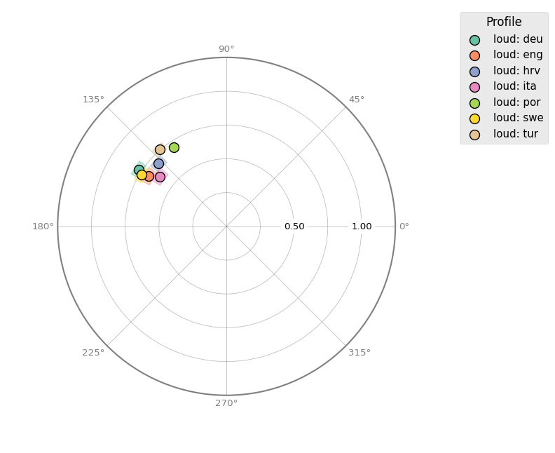
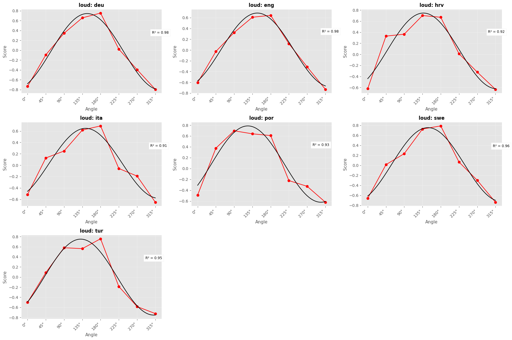
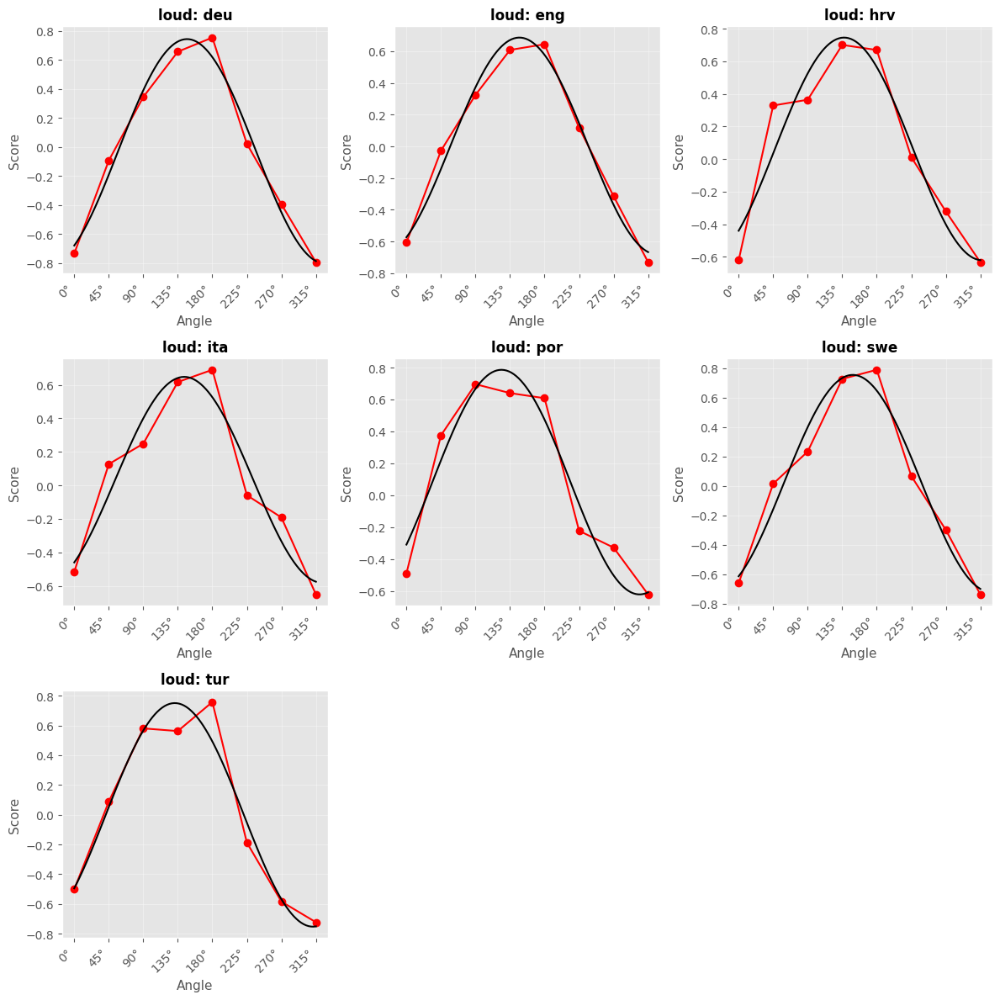
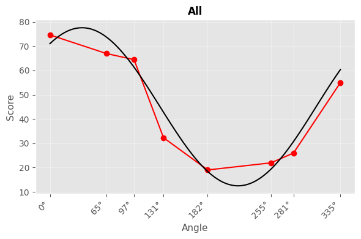

# Random Examples


``` python
%load_ext autoreload
%matplotlib inline

import matplotlib.pyplot as plt
import pandas as pd

import circumplex
from circumplex import octants

data = pd.read_excel(
    "/Users/mitch/Library/CloudStorage/OneDrive-UniversityCollegeLondon/_Fellowship/Papers - Drafts/J2308_APA_SATP-Main/data/SATP Dataset v1.4.xlsx"  # noqa: E501
)
```

``` python
%autoreload
plt.style.use("ggplot")
scales = ["PAQ1", "PAQ2", "PAQ3", "PAQ4", "PAQ5", "PAQ6", "PAQ7", "PAQ8"]

ssm_res = circumplex.ssm_analyze(
    data, scales, angles=octants(), grouping="Language", measures=["loud"]
)
fig = ssm_res.plot_circle()
plt.show()
```



``` python
ssm_res.summary()
```

<pre style="white-space:pre;overflow-x:auto;line-height:normal;font-family:Menlo,'DejaVu Sans Mono',consolas,'Courier New',monospace">Statistical Basis:   Correlation Scores
Bootstrap Resamples: <span style="color: #008080; text-decoration-color: #008080; font-weight: bold">2000</span>
Confidence Level:    <span style="color: #008080; text-decoration-color: #008080; font-weight: bold">0.95</span>
Listwise Deletion:   <span style="color: #00ff00; text-decoration-color: #00ff00; font-style: italic">True</span>
Scale Displacements: <span style="font-weight: bold">[</span><span style="color: #008080; text-decoration-color: #008080; font-weight: bold">0.0</span>, <span style="color: #008080; text-decoration-color: #008080; font-weight: bold">45.0</span>, <span style="color: #008080; text-decoration-color: #008080; font-weight: bold">90.0</span>, <span style="color: #008080; text-decoration-color: #008080; font-weight: bold">135.0</span>, <span style="color: #008080; text-decoration-color: #008080; font-weight: bold">180.0</span>, <span style="color: #008080; text-decoration-color: #008080; font-weight: bold">225.0</span>, <span style="color: #008080; text-decoration-color: #008080; font-weight: bold">270.0</span>, <span style="color: #008080; text-decoration-color: #008080; font-weight: bold">315.0</span><span style="font-weight: bold">]</span>


<span style="font-style: italic">                     Profile                     </span>
┏━━━━━━━━━━━━━━┳━━━━━━━━━━┳━━━━━━━━━━┳━━━━━━━━━━┓
┃<span style="font-weight: bold">              </span>┃<span style="font-weight: bold"> Estimate </span>┃<span style="font-weight: bold"> Lower CI </span>┃<span style="font-weight: bold"> Upper CI </span>┃
┡━━━━━━━━━━━━━━╇━━━━━━━━━━╇━━━━━━━━━━╇━━━━━━━━━━┩
│ Elevation    │ -0.03    │ -0.043   │ -0.018   │
│ X-Value      │ -0.649   │ -0.683   │ -0.614   │
│ Y-Value      │ 0.421    │ 0.366    │ 0.471    │
│ Amplitude    │ 0.774    │ 0.743    │ 0.805    │
│ Displacement │ 147.051  │ 143.151  │ 151.255  │
│ Model Fit    │ 0.978    │          │          │
└──────────────┴──────────┴──────────┴──────────┘
<span style="font-style: italic">                     Profile                     </span>
┏━━━━━━━━━━━━━━┳━━━━━━━━━━┳━━━━━━━━━━┳━━━━━━━━━━┓
┃<span style="font-weight: bold">              </span>┃<span style="font-weight: bold"> Estimate </span>┃<span style="font-weight: bold"> Lower CI </span>┃<span style="font-weight: bold"> Upper CI </span>┃
┡━━━━━━━━━━━━━━╇━━━━━━━━━━╇━━━━━━━━━━╇━━━━━━━━━━┩
│ Elevation    │ 0.002    │ -0.012   │ 0.016    │
│ X-Value      │ -0.575   │ -0.619   │ -0.53    │
│ Y-Value      │ 0.371    │ 0.32     │ 0.422    │
│ Amplitude    │ 0.684    │ 0.647    │ 0.722    │
│ Displacement │ 147.187  │ 142.638  │ 151.806  │
│ Model Fit    │ 0.983    │          │          │
└──────────────┴──────────┴──────────┴──────────┘
<span style="font-style: italic">                     Profile                     </span>
┏━━━━━━━━━━━━━━┳━━━━━━━━━━┳━━━━━━━━━━┳━━━━━━━━━━┓
┃<span style="font-weight: bold">              </span>┃<span style="font-weight: bold"> Estimate </span>┃<span style="font-weight: bold"> Lower CI </span>┃<span style="font-weight: bold"> Upper CI </span>┃
┡━━━━━━━━━━━━━━╇━━━━━━━━━━╇━━━━━━━━━━╇━━━━━━━━━━┩
│ Elevation    │ 0.062    │ 0.049    │ 0.075    │
│ X-Value      │ -0.502   │ -0.545   │ -0.459   │
│ Y-Value      │ 0.463    │ 0.417    │ 0.508    │
│ Amplitude    │ 0.684    │ 0.647    │ 0.718    │
│ Displacement │ 137.315  │ 132.946  │ 141.561  │
│ Model Fit    │ 0.916    │          │          │
└──────────────┴──────────┴──────────┴──────────┘
<span style="font-style: italic">                     Profile                     </span>
┏━━━━━━━━━━━━━━┳━━━━━━━━━━┳━━━━━━━━━━┳━━━━━━━━━━┓
┃<span style="font-weight: bold">              </span>┃<span style="font-weight: bold"> Estimate </span>┃<span style="font-weight: bold"> Lower CI </span>┃<span style="font-weight: bold"> Upper CI </span>┃
┡━━━━━━━━━━━━━━╇━━━━━━━━━━╇━━━━━━━━━━╇━━━━━━━━━━┩
│ Elevation    │ 0.033    │ 0.014    │ 0.053    │
│ X-Value      │ -0.493   │ -0.533   │ -0.454   │
│ Y-Value      │ 0.367    │ 0.315    │ 0.418    │
│ Amplitude    │ 0.615    │ 0.577    │ 0.654    │
│ Displacement │ 143.332  │ 138.42   │ 148.371  │
│ Model Fit    │ 0.912    │          │          │
└──────────────┴──────────┴──────────┴──────────┘
<span style="font-style: italic">                     Profile                     </span>
┏━━━━━━━━━━━━━━┳━━━━━━━━━━┳━━━━━━━━━━┳━━━━━━━━━━┓
┃<span style="font-weight: bold">              </span>┃<span style="font-weight: bold"> Estimate </span>┃<span style="font-weight: bold"> Lower CI </span>┃<span style="font-weight: bold"> Upper CI </span>┃
┡━━━━━━━━━━━━━━╇━━━━━━━━━━╇━━━━━━━━━━╇━━━━━━━━━━┩
│ Elevation    │ 0.082    │ 0.069    │ 0.095    │
│ X-Value      │ -0.392   │ -0.419   │ -0.365   │
│ Y-Value      │ 0.585    │ 0.557    │ 0.614    │
│ Amplitude    │ 0.704    │ 0.676    │ 0.732    │
│ Displacement │ 123.804  │ 121.532  │ 126.017  │
│ Model Fit    │ 0.929    │          │          │
└──────────────┴──────────┴──────────┴──────────┘
<span style="font-style: italic">                     Profile                     </span>
┏━━━━━━━━━━━━━━┳━━━━━━━━━━┳━━━━━━━━━━┳━━━━━━━━━━┓
┃<span style="font-weight: bold">              </span>┃<span style="font-weight: bold"> Estimate </span>┃<span style="font-weight: bold"> Lower CI </span>┃<span style="font-weight: bold"> Upper CI </span>┃
┡━━━━━━━━━━━━━━╇━━━━━━━━━━╇━━━━━━━━━━╇━━━━━━━━━━┩
│ Elevation    │ 0.016    │ 0.003    │ 0.03     │
│ X-Value      │ -0.63    │ -0.664   │ -0.595   │
│ Y-Value      │ 0.382    │ 0.331    │ 0.432    │
│ Amplitude    │ 0.737    │ 0.708    │ 0.766    │
│ Displacement │ 148.747  │ 144.514  │ 153.013  │
│ Model Fit    │ 0.956    │          │          │
└──────────────┴──────────┴──────────┴──────────┘
<span style="font-style: italic">                     Profile                     </span>
┏━━━━━━━━━━━━━━┳━━━━━━━━━━┳━━━━━━━━━━┳━━━━━━━━━━┓
┃<span style="font-weight: bold">              </span>┃<span style="font-weight: bold"> Estimate </span>┃<span style="font-weight: bold"> Lower CI </span>┃<span style="font-weight: bold"> Upper CI </span>┃
┡━━━━━━━━━━━━━━╇━━━━━━━━━━╇━━━━━━━━━━╇━━━━━━━━━━┩
│ Elevation    │ -0.001   │ -0.019   │ 0.017    │
│ X-Value      │ -0.494   │ -0.528   │ -0.458   │
│ Y-Value      │ 0.567    │ 0.523    │ 0.609    │
│ Amplitude    │ 0.752    │ 0.72     │ 0.784    │
│ Displacement │ 131.042  │ 127.782  │ 134.461  │
│ Model Fit    │ 0.947    │          │          │
└──────────────┴──────────┴──────────┴──────────┘
</pre>

``` python
fig = ssm_res.plot_curve(incl_fit=True)
plt.tight_layout()
plt.show()
```



``` python
test = circumplex.ssm_analyze(
    data, scales, angles=octants(), measures=["loud"], grouping="Language"
)
test.summary()
```

<pre style="white-space:pre;overflow-x:auto;line-height:normal;font-family:Menlo,'DejaVu Sans Mono',consolas,'Courier New',monospace">Statistical Basis:   Correlation Scores
Bootstrap Resamples: <span style="color: #008080; text-decoration-color: #008080; font-weight: bold">2000</span>
Confidence Level:    <span style="color: #008080; text-decoration-color: #008080; font-weight: bold">0.95</span>
Listwise Deletion:   <span style="color: #00ff00; text-decoration-color: #00ff00; font-style: italic">True</span>
Scale Displacements: <span style="font-weight: bold">[</span><span style="color: #008080; text-decoration-color: #008080; font-weight: bold">0.0</span>, <span style="color: #008080; text-decoration-color: #008080; font-weight: bold">45.0</span>, <span style="color: #008080; text-decoration-color: #008080; font-weight: bold">90.0</span>, <span style="color: #008080; text-decoration-color: #008080; font-weight: bold">135.0</span>, <span style="color: #008080; text-decoration-color: #008080; font-weight: bold">180.0</span>, <span style="color: #008080; text-decoration-color: #008080; font-weight: bold">225.0</span>, <span style="color: #008080; text-decoration-color: #008080; font-weight: bold">270.0</span>, <span style="color: #008080; text-decoration-color: #008080; font-weight: bold">315.0</span><span style="font-weight: bold">]</span>


<span style="font-style: italic">                     Profile                     </span>
┏━━━━━━━━━━━━━━┳━━━━━━━━━━┳━━━━━━━━━━┳━━━━━━━━━━┓
┃<span style="font-weight: bold">              </span>┃<span style="font-weight: bold"> Estimate </span>┃<span style="font-weight: bold"> Lower CI </span>┃<span style="font-weight: bold"> Upper CI </span>┃
┡━━━━━━━━━━━━━━╇━━━━━━━━━━╇━━━━━━━━━━╇━━━━━━━━━━┩
│ Elevation    │ -0.03    │ -0.043   │ -0.017   │
│ X-Value      │ -0.649   │ -0.682   │ -0.614   │
│ Y-Value      │ 0.421    │ 0.367    │ 0.471    │
│ Amplitude    │ 0.774    │ 0.744    │ 0.804    │
│ Displacement │ 147.051  │ 143.049  │ 151.4    │
│ Model Fit    │ 0.978    │          │          │
└──────────────┴──────────┴──────────┴──────────┘
<span style="font-style: italic">                     Profile                     </span>
┏━━━━━━━━━━━━━━┳━━━━━━━━━━┳━━━━━━━━━━┳━━━━━━━━━━┓
┃<span style="font-weight: bold">              </span>┃<span style="font-weight: bold"> Estimate </span>┃<span style="font-weight: bold"> Lower CI </span>┃<span style="font-weight: bold"> Upper CI </span>┃
┡━━━━━━━━━━━━━━╇━━━━━━━━━━╇━━━━━━━━━━╇━━━━━━━━━━┩
│ Elevation    │ 0.002    │ -0.013   │ 0.016    │
│ X-Value      │ -0.575   │ -0.619   │ -0.525   │
│ Y-Value      │ 0.371    │ 0.318    │ 0.422    │
│ Amplitude    │ 0.684    │ 0.646    │ 0.722    │
│ Displacement │ 147.187  │ 142.359  │ 152.087  │
│ Model Fit    │ 0.983    │          │          │
└──────────────┴──────────┴──────────┴──────────┘
<span style="font-style: italic">                     Profile                     </span>
┏━━━━━━━━━━━━━━┳━━━━━━━━━━┳━━━━━━━━━━┳━━━━━━━━━━┓
┃<span style="font-weight: bold">              </span>┃<span style="font-weight: bold"> Estimate </span>┃<span style="font-weight: bold"> Lower CI </span>┃<span style="font-weight: bold"> Upper CI </span>┃
┡━━━━━━━━━━━━━━╇━━━━━━━━━━╇━━━━━━━━━━╇━━━━━━━━━━┩
│ Elevation    │ 0.062    │ 0.05     │ 0.075    │
│ X-Value      │ -0.502   │ -0.543   │ -0.459   │
│ Y-Value      │ 0.463    │ 0.415    │ 0.512    │
│ Amplitude    │ 0.684    │ 0.648    │ 0.718    │
│ Displacement │ 137.315  │ 132.725  │ 141.726  │
│ Model Fit    │ 0.916    │          │          │
└──────────────┴──────────┴──────────┴──────────┘
<span style="font-style: italic">                     Profile                     </span>
┏━━━━━━━━━━━━━━┳━━━━━━━━━━┳━━━━━━━━━━┳━━━━━━━━━━┓
┃<span style="font-weight: bold">              </span>┃<span style="font-weight: bold"> Estimate </span>┃<span style="font-weight: bold"> Lower CI </span>┃<span style="font-weight: bold"> Upper CI </span>┃
┡━━━━━━━━━━━━━━╇━━━━━━━━━━╇━━━━━━━━━━╇━━━━━━━━━━┩
│ Elevation    │ 0.033    │ 0.014    │ 0.052    │
│ X-Value      │ -0.493   │ -0.532   │ -0.45    │
│ Y-Value      │ 0.367    │ 0.315    │ 0.418    │
│ Amplitude    │ 0.615    │ 0.575    │ 0.653    │
│ Displacement │ 143.332  │ 138.393  │ 148.466  │
│ Model Fit    │ 0.912    │          │          │
└──────────────┴──────────┴──────────┴──────────┘
<span style="font-style: italic">                     Profile                     </span>
┏━━━━━━━━━━━━━━┳━━━━━━━━━━┳━━━━━━━━━━┳━━━━━━━━━━┓
┃<span style="font-weight: bold">              </span>┃<span style="font-weight: bold"> Estimate </span>┃<span style="font-weight: bold"> Lower CI </span>┃<span style="font-weight: bold"> Upper CI </span>┃
┡━━━━━━━━━━━━━━╇━━━━━━━━━━╇━━━━━━━━━━╇━━━━━━━━━━┩
│ Elevation    │ 0.082    │ 0.069    │ 0.095    │
│ X-Value      │ -0.392   │ -0.419   │ -0.362   │
│ Y-Value      │ 0.585    │ 0.554    │ 0.614    │
│ Amplitude    │ 0.704    │ 0.676    │ 0.732    │
│ Displacement │ 123.804  │ 121.435  │ 126.105  │
│ Model Fit    │ 0.929    │          │          │
└──────────────┴──────────┴──────────┴──────────┘
<span style="font-style: italic">                     Profile                     </span>
┏━━━━━━━━━━━━━━┳━━━━━━━━━━┳━━━━━━━━━━┳━━━━━━━━━━┓
┃<span style="font-weight: bold">              </span>┃<span style="font-weight: bold"> Estimate </span>┃<span style="font-weight: bold"> Lower CI </span>┃<span style="font-weight: bold"> Upper CI </span>┃
┡━━━━━━━━━━━━━━╇━━━━━━━━━━╇━━━━━━━━━━╇━━━━━━━━━━┩
│ Elevation    │ 0.016    │ 0.002    │ 0.029    │
│ X-Value      │ -0.63    │ -0.666   │ -0.596   │
│ Y-Value      │ 0.382    │ 0.33     │ 0.435    │
│ Amplitude    │ 0.737    │ 0.708    │ 0.766    │
│ Displacement │ 148.747  │ 144.483  │ 153.22   │
│ Model Fit    │ 0.956    │          │          │
└──────────────┴──────────┴──────────┴──────────┘
<span style="font-style: italic">                     Profile                     </span>
┏━━━━━━━━━━━━━━┳━━━━━━━━━━┳━━━━━━━━━━┳━━━━━━━━━━┓
┃<span style="font-weight: bold">              </span>┃<span style="font-weight: bold"> Estimate </span>┃<span style="font-weight: bold"> Lower CI </span>┃<span style="font-weight: bold"> Upper CI </span>┃
┡━━━━━━━━━━━━━━╇━━━━━━━━━━╇━━━━━━━━━━╇━━━━━━━━━━┩
│ Elevation    │ -0.001   │ -0.019   │ 0.016    │
│ X-Value      │ -0.494   │ -0.527   │ -0.458   │
│ Y-Value      │ 0.567    │ 0.524    │ 0.609    │
│ Amplitude    │ 0.752    │ 0.719    │ 0.785    │
│ Displacement │ 131.042  │ 127.857  │ 134.336  │
│ Model Fit    │ 0.947    │          │          │
└──────────────┴──────────┴──────────┴──────────┘
</pre>

``` python
test.results.round(3)
```

<div>
<style scoped>
    .dataframe tbody tr th:only-of-type {
        vertical-align: middle;
    }

    .dataframe tbody tr th {
        vertical-align: top;
    }

    .dataframe thead th {
        text-align: right;
    }
</style>

<table class="dataframe" data-quarto-postprocess="true" data-border="1">
<thead>
<tr style="text-align: right;">
<th data-quarto-table-cell-role="th"></th>
<th data-quarto-table-cell-role="th">Label</th>
<th data-quarto-table-cell-role="th">Group</th>
<th data-quarto-table-cell-role="th">Measure</th>
<th data-quarto-table-cell-role="th">e_est</th>
<th data-quarto-table-cell-role="th">e_lci</th>
<th data-quarto-table-cell-role="th">e_uci</th>
<th data-quarto-table-cell-role="th">x_est</th>
<th data-quarto-table-cell-role="th">x_lci</th>
<th data-quarto-table-cell-role="th">x_uci</th>
<th data-quarto-table-cell-role="th">y_est</th>
<th data-quarto-table-cell-role="th">y_lci</th>
<th data-quarto-table-cell-role="th">y_uci</th>
<th data-quarto-table-cell-role="th">a_est</th>
<th data-quarto-table-cell-role="th">a_lci</th>
<th data-quarto-table-cell-role="th">a_uci</th>
<th data-quarto-table-cell-role="th">d_est</th>
<th data-quarto-table-cell-role="th">d_lci</th>
<th data-quarto-table-cell-role="th">d_uci</th>
<th data-quarto-table-cell-role="th">fit_est</th>
</tr>
</thead>
<tbody>
<tr>
<td data-quarto-table-cell-role="th">0</td>
<td>loud: deu</td>
<td>deu</td>
<td>loud</td>
<td>-0.030</td>
<td>-0.043</td>
<td>-0.017</td>
<td>-0.649</td>
<td>-0.682</td>
<td>-0.614</td>
<td>0.421</td>
<td>0.367</td>
<td>0.471</td>
<td>0.774</td>
<td>0.744</td>
<td>0.804</td>
<td>147.051</td>
<td>143.049</td>
<td>151.400</td>
<td>0.978</td>
</tr>
<tr>
<td data-quarto-table-cell-role="th">1</td>
<td>loud: eng</td>
<td>eng</td>
<td>loud</td>
<td>0.002</td>
<td>-0.013</td>
<td>0.016</td>
<td>-0.575</td>
<td>-0.619</td>
<td>-0.525</td>
<td>0.371</td>
<td>0.318</td>
<td>0.422</td>
<td>0.684</td>
<td>0.646</td>
<td>0.722</td>
<td>147.187</td>
<td>142.359</td>
<td>152.087</td>
<td>0.983</td>
</tr>
<tr>
<td data-quarto-table-cell-role="th">2</td>
<td>loud: hrv</td>
<td>hrv</td>
<td>loud</td>
<td>0.062</td>
<td>0.050</td>
<td>0.075</td>
<td>-0.502</td>
<td>-0.543</td>
<td>-0.459</td>
<td>0.463</td>
<td>0.415</td>
<td>0.512</td>
<td>0.684</td>
<td>0.648</td>
<td>0.718</td>
<td>137.315</td>
<td>132.725</td>
<td>141.726</td>
<td>0.916</td>
</tr>
<tr>
<td data-quarto-table-cell-role="th">3</td>
<td>loud: ita</td>
<td>ita</td>
<td>loud</td>
<td>0.033</td>
<td>0.014</td>
<td>0.052</td>
<td>-0.493</td>
<td>-0.532</td>
<td>-0.450</td>
<td>0.367</td>
<td>0.315</td>
<td>0.418</td>
<td>0.615</td>
<td>0.575</td>
<td>0.653</td>
<td>143.332</td>
<td>138.393</td>
<td>148.466</td>
<td>0.912</td>
</tr>
<tr>
<td data-quarto-table-cell-role="th">4</td>
<td>loud: por</td>
<td>por</td>
<td>loud</td>
<td>0.082</td>
<td>0.069</td>
<td>0.095</td>
<td>-0.392</td>
<td>-0.419</td>
<td>-0.362</td>
<td>0.585</td>
<td>0.554</td>
<td>0.614</td>
<td>0.704</td>
<td>0.676</td>
<td>0.732</td>
<td>123.804</td>
<td>121.435</td>
<td>126.105</td>
<td>0.929</td>
</tr>
<tr>
<td data-quarto-table-cell-role="th">5</td>
<td>loud: swe</td>
<td>swe</td>
<td>loud</td>
<td>0.016</td>
<td>0.002</td>
<td>0.029</td>
<td>-0.630</td>
<td>-0.666</td>
<td>-0.596</td>
<td>0.382</td>
<td>0.330</td>
<td>0.435</td>
<td>0.737</td>
<td>0.708</td>
<td>0.766</td>
<td>148.747</td>
<td>144.483</td>
<td>153.220</td>
<td>0.956</td>
</tr>
<tr>
<td data-quarto-table-cell-role="th">6</td>
<td>loud: tur</td>
<td>tur</td>
<td>loud</td>
<td>-0.001</td>
<td>-0.019</td>
<td>0.016</td>
<td>-0.494</td>
<td>-0.527</td>
<td>-0.458</td>
<td>0.567</td>
<td>0.524</td>
<td>0.609</td>
<td>0.752</td>
<td>0.719</td>
<td>0.785</td>
<td>131.042</td>
<td>127.857</td>
<td>134.336</td>
<td>0.947</td>
</tr>
</tbody>
</table>

</div>

``` python
ssm_res.plot_curve(figsize=(12, 12))
plt.show()
```



``` python
ssm_res.results.round(3)
```

<div>
<style scoped>
    .dataframe tbody tr th:only-of-type {
        vertical-align: middle;
    }

    .dataframe tbody tr th {
        vertical-align: top;
    }

    .dataframe thead th {
        text-align: right;
    }
</style>

<table class="dataframe" data-quarto-postprocess="true" data-border="1">
<thead>
<tr style="text-align: right;">
<th data-quarto-table-cell-role="th"></th>
<th data-quarto-table-cell-role="th">Label</th>
<th data-quarto-table-cell-role="th">Group</th>
<th data-quarto-table-cell-role="th">Measure</th>
<th data-quarto-table-cell-role="th">e_est</th>
<th data-quarto-table-cell-role="th">e_lci</th>
<th data-quarto-table-cell-role="th">e_uci</th>
<th data-quarto-table-cell-role="th">x_est</th>
<th data-quarto-table-cell-role="th">x_lci</th>
<th data-quarto-table-cell-role="th">x_uci</th>
<th data-quarto-table-cell-role="th">y_est</th>
<th data-quarto-table-cell-role="th">y_lci</th>
<th data-quarto-table-cell-role="th">y_uci</th>
<th data-quarto-table-cell-role="th">a_est</th>
<th data-quarto-table-cell-role="th">a_lci</th>
<th data-quarto-table-cell-role="th">a_uci</th>
<th data-quarto-table-cell-role="th">d_est</th>
<th data-quarto-table-cell-role="th">d_lci</th>
<th data-quarto-table-cell-role="th">d_uci</th>
<th data-quarto-table-cell-role="th">fit_est</th>
</tr>
</thead>
<tbody>
<tr>
<td data-quarto-table-cell-role="th">0</td>
<td>loud: deu</td>
<td>deu</td>
<td>loud</td>
<td>-0.030</td>
<td>-0.043</td>
<td>-0.018</td>
<td>-0.649</td>
<td>-0.683</td>
<td>-0.614</td>
<td>0.421</td>
<td>0.366</td>
<td>0.471</td>
<td>0.774</td>
<td>0.743</td>
<td>0.805</td>
<td>147.051</td>
<td>143.151</td>
<td>151.255</td>
<td>0.978</td>
</tr>
<tr>
<td data-quarto-table-cell-role="th">1</td>
<td>loud: eng</td>
<td>eng</td>
<td>loud</td>
<td>0.002</td>
<td>-0.012</td>
<td>0.016</td>
<td>-0.575</td>
<td>-0.619</td>
<td>-0.530</td>
<td>0.371</td>
<td>0.320</td>
<td>0.422</td>
<td>0.684</td>
<td>0.647</td>
<td>0.722</td>
<td>147.187</td>
<td>142.638</td>
<td>151.806</td>
<td>0.983</td>
</tr>
<tr>
<td data-quarto-table-cell-role="th">2</td>
<td>loud: hrv</td>
<td>hrv</td>
<td>loud</td>
<td>0.062</td>
<td>0.049</td>
<td>0.075</td>
<td>-0.502</td>
<td>-0.545</td>
<td>-0.459</td>
<td>0.463</td>
<td>0.417</td>
<td>0.508</td>
<td>0.684</td>
<td>0.647</td>
<td>0.718</td>
<td>137.315</td>
<td>132.946</td>
<td>141.561</td>
<td>0.916</td>
</tr>
<tr>
<td data-quarto-table-cell-role="th">3</td>
<td>loud: ita</td>
<td>ita</td>
<td>loud</td>
<td>0.033</td>
<td>0.014</td>
<td>0.053</td>
<td>-0.493</td>
<td>-0.533</td>
<td>-0.454</td>
<td>0.367</td>
<td>0.315</td>
<td>0.418</td>
<td>0.615</td>
<td>0.577</td>
<td>0.654</td>
<td>143.332</td>
<td>138.420</td>
<td>148.371</td>
<td>0.912</td>
</tr>
<tr>
<td data-quarto-table-cell-role="th">4</td>
<td>loud: por</td>
<td>por</td>
<td>loud</td>
<td>0.082</td>
<td>0.069</td>
<td>0.095</td>
<td>-0.392</td>
<td>-0.419</td>
<td>-0.365</td>
<td>0.585</td>
<td>0.557</td>
<td>0.614</td>
<td>0.704</td>
<td>0.676</td>
<td>0.732</td>
<td>123.804</td>
<td>121.532</td>
<td>126.017</td>
<td>0.929</td>
</tr>
<tr>
<td data-quarto-table-cell-role="th">5</td>
<td>loud: swe</td>
<td>swe</td>
<td>loud</td>
<td>0.016</td>
<td>0.003</td>
<td>0.030</td>
<td>-0.630</td>
<td>-0.664</td>
<td>-0.595</td>
<td>0.382</td>
<td>0.331</td>
<td>0.432</td>
<td>0.737</td>
<td>0.708</td>
<td>0.766</td>
<td>148.747</td>
<td>144.514</td>
<td>153.013</td>
<td>0.956</td>
</tr>
<tr>
<td data-quarto-table-cell-role="th">6</td>
<td>loud: tur</td>
<td>tur</td>
<td>loud</td>
<td>-0.001</td>
<td>-0.019</td>
<td>0.017</td>
<td>-0.494</td>
<td>-0.528</td>
<td>-0.458</td>
<td>0.567</td>
<td>0.523</td>
<td>0.609</td>
<td>0.752</td>
<td>0.720</td>
<td>0.784</td>
<td>131.042</td>
<td>127.782</td>
<td>134.461</td>
<td>0.947</td>
</tr>
</tbody>
</table>

</div>

lang_angles = { “arb”: (0, 65, 97, 131, 182, 255, 281, 335), “cmn”: (0,
65, 97, 131, 182, 255, 281, 335), “deu”: (0, 65, 97, 131, 182, 255, 281,
335), “ell”: (0, 65, 97, 131, 182, 255, 281, 335), “eng”: (0, 46, 93,
138, 182, 228, 272, 340), “fra”: (0, 65, 97, 131, 182, 255, 281, 335),
“hrv”: (0, 65, 97, 131, 182, 255, 281, 335), “ind”: (0, 65, 97, 131,
182, 255, 281, 335), “ita”: (0, 65, 97, 131, 182, 255, 281, 335), “jpn”:
(0, 65, 97, 131, 182, 255, 281, 335), “kor”: (0, 65, 97, 131, 182, 255,
281, 335), “nld”: (0, 65, 97, 131, 182, 255, 281, 335), “por”: (0, 65,
97, 131, 182, 255, 281, 335), “spa”: (0, 65, 97, 131, 182, 255, 281,
335), “swe”: (0, 65, 97, 131, 182, 255, 281, 335), “tur”: (0, 65, 97,
131, 182, 255, 281, 335), “vie”: (0, 65, 97, 131, 182, 255, 281, 335),
“zsm”: (0, 65, 97, 131, 182, 255, 281, 335), }

# Updated to use ssm_analyze instead of ssm_analyse

corr_res = circumplex.ssm_analyze( data, scales, measures=\[“loud”\],
grouping=“Language”, grouped_angles=lang_angles ) corr_res.plot()

``` python
lang_data = data[data["Language"] == "deu"]
rec_data = data[data["Recording"] == "CG01"]
angles = [0, 65, 97, 131, 182, 255, 281, 335]
new_ang_results = circumplex.ssm_analyze(rec_data, scales, angles=angles)

new_ang_results.summary()
```

<pre style="white-space:pre;overflow-x:auto;line-height:normal;font-family:Menlo,'DejaVu Sans Mono',consolas,'Courier New',monospace">Statistical Basis:   Mean Scores
Bootstrap Resamples: <span style="color: #008080; text-decoration-color: #008080; font-weight: bold">2000</span>
Confidence Level:    <span style="color: #008080; text-decoration-color: #008080; font-weight: bold">0.95</span>
Listwise Deletion:   <span style="color: #00ff00; text-decoration-color: #00ff00; font-style: italic">True</span>
Scale Displacements: <span style="font-weight: bold">[</span><span style="color: #008080; text-decoration-color: #008080; font-weight: bold">0.0</span>, <span style="color: #008080; text-decoration-color: #008080; font-weight: bold">65.0</span>, <span style="color: #008080; text-decoration-color: #008080; font-weight: bold">97.0</span>, <span style="color: #008080; text-decoration-color: #008080; font-weight: bold">131.0</span>, <span style="color: #008080; text-decoration-color: #008080; font-weight: bold">182.0</span>, <span style="color: #008080; text-decoration-color: #008080; font-weight: bold">255.00000000000003</span>, <span style="color: #008080; text-decoration-color: #008080; font-weight: bold">281.0</span>, <span style="color: #008080; text-decoration-color: #008080; font-weight: bold">335.0</span><span style="font-weight: bold">]</span>


<span style="font-style: italic">                  Profile[All]                   </span>
┏━━━━━━━━━━━━━━┳━━━━━━━━━━┳━━━━━━━━━━┳━━━━━━━━━━┓
┃<span style="font-weight: bold">              </span>┃<span style="font-weight: bold"> Estimate </span>┃<span style="font-weight: bold"> Lower CI </span>┃<span style="font-weight: bold"> Upper CI </span>┃
┡━━━━━━━━━━━━━━╇━━━━━━━━━━╇━━━━━━━━━━╇━━━━━━━━━━┩
│ Elevation    │ 45.041   │ 44.485   │ 45.596   │
│ X-Value      │ 26.004   │ 24.778   │ 27.186   │
│ Y-Value      │ 19.611   │ 18.378   │ 20.826   │
│ Amplitude    │ 32.57    │ 31.542   │ 33.661   │
│ Displacement │ 37.021   │ 34.702   │ 39.371   │
│ Model Fit    │ 0.934    │          │          │
└──────────────┴──────────┴──────────┴──────────┘
</pre>

``` python
new_ang_results.plot_curve()
plt.show()
```



``` python
new_ang_results.results["d_est"].round(2)
```

    0    37.02
    Name: d_est, dtype: float64

``` python
new_ang_results.results["e_est"].round(2)
```

    0    45.04
    Name: e_est, dtype: float64
