# Introduction to SSM Analysis


This notebook provides an introduction to Structural Summary Method
(SSM) analysis using the circumplex package.

``` python
from great_tables import GT

from circumplex import load_dataset, ssm_analyze
```

## 1. Loading Example Data: jz2017

We’ll use the `jz2017` dataset from Zimmermann & Wright (2017). This
dataset includes self-report data from 1166 undergraduate students who
completed:

-   A circumplex measure of interpersonal problems (IIP-SC) with eight
    subscales: PA, BC, DE, FG, HI, JK, LM, NO
-   A measure of personality disorder symptoms with ten subscales:
    PARPD, SCZPD, SZTPD, ASPD, BORPD, HISPD, NARPD, AVPD, DPNPD, OCPD

``` python
jz2017 = load_dataset("jz2017")
GT(jz2017.head())
```

<div id="lfatzmxfyi" style="padding-left:0px;padding-right:0px;padding-top:10px;padding-bottom:10px;overflow-x:auto;overflow-y:auto;width:auto;height:auto;">
<style>
#lfatzmxfyi table {
          font-family: -apple-system, BlinkMacSystemFont, 'Segoe UI', Roboto, Oxygen, Ubuntu, Cantarell, 'Helvetica Neue', 'Fira Sans', 'Droid Sans', Arial, sans-serif;
          -webkit-font-smoothing: antialiased;
          -moz-osx-font-smoothing: grayscale;
        }

#lfatzmxfyi thead, tbody, tfoot, tr, td, th { border-style: none !important; }
 tr { background-color: transparent !important; }
#lfatzmxfyi p { margin: 0 !important; padding: 0 !important; }
 #lfatzmxfyi .gt_table { display: table !important; border-collapse: collapse !important; line-height: normal !important; margin-left: auto !important; margin-right: auto !important; color: #333333 !important; font-size: 16px !important; font-weight: normal !important; font-style: normal !important; background-color: #FFFFFF !important; width: auto !important; border-top-style: solid !important; border-top-width: 2px !important; border-top-color: #A8A8A8 !important; border-right-style: none !important; border-right-width: 2px !important; border-right-color: #D3D3D3 !important; border-bottom-style: solid !important; border-bottom-width: 2px !important; border-bottom-color: #A8A8A8 !important; border-left-style: none !important; border-left-width: 2px !important; border-left-color: #D3D3D3 !important; }
 #lfatzmxfyi .gt_caption { padding-top: 4px !important; padding-bottom: 4px !important; }
 #lfatzmxfyi .gt_title { color: #333333 !important; font-size: 125% !important; font-weight: initial !important; padding-top: 4px !important; padding-bottom: 4px !important; padding-left: 5px !important; padding-right: 5px !important; border-bottom-color: #FFFFFF !important; border-bottom-width: 0 !important; }
 #lfatzmxfyi .gt_subtitle { color: #333333 !important; font-size: 85% !important; font-weight: initial !important; padding-top: 3px !important; padding-bottom: 5px !important; padding-left: 5px !important; padding-right: 5px !important; border-top-color: #FFFFFF !important; border-top-width: 0 !important; }
 #lfatzmxfyi .gt_heading { background-color: #FFFFFF !important; text-align: center !important; border-bottom-color: #FFFFFF !important; border-left-style: none !important; border-left-width: 1px !important; border-left-color: #D3D3D3 !important; border-right-style: none !important; border-right-width: 1px !important; border-right-color: #D3D3D3 !important; }
 #lfatzmxfyi .gt_bottom_border { border-bottom-style: solid !important; border-bottom-width: 2px !important; border-bottom-color: #D3D3D3 !important; }
 #lfatzmxfyi .gt_col_headings { border-top-style: solid !important; border-top-width: 2px !important; border-top-color: #D3D3D3 !important; border-bottom-style: solid !important; border-bottom-width: 2px !important; border-bottom-color: #D3D3D3 !important; border-left-style: none !important; border-left-width: 1px !important; border-left-color: #D3D3D3 !important; border-right-style: none !important; border-right-width: 1px !important; border-right-color: #D3D3D3 !important; }
 #lfatzmxfyi .gt_col_heading { color: #333333 !important; background-color: #FFFFFF !important; font-size: 100% !important; font-weight: normal !important; text-transform: inherit !important; border-left-style: none !important; border-left-width: 1px !important; border-left-color: #D3D3D3 !important; border-right-style: none !important; border-right-width: 1px !important; border-right-color: #D3D3D3 !important; vertical-align: bottom !important; padding-top: 5px !important; padding-bottom: 5px !important; padding-left: 5px !important; padding-right: 5px !important; overflow-x: hidden !important; }
 #lfatzmxfyi .gt_column_spanner_outer { color: #333333 !important; background-color: #FFFFFF !important; font-size: 100% !important; font-weight: normal !important; text-transform: inherit !important; padding-top: 0 !important; padding-bottom: 0 !important; padding-left: 4px !important; padding-right: 4px !important; }
 #lfatzmxfyi .gt_column_spanner_outer:first-child { padding-left: 0 !important; }
 #lfatzmxfyi .gt_column_spanner_outer:last-child { padding-right: 0 !important; }
 #lfatzmxfyi .gt_column_spanner { border-bottom-style: solid !important; border-bottom-width: 2px !important; border-bottom-color: #D3D3D3 !important; vertical-align: bottom !important; padding-top: 5px !important; padding-bottom: 5px !important; overflow-x: hidden !important; display: inline-block !important; width: 100% !important; }
 #lfatzmxfyi .gt_spanner_row { border-bottom-style: hidden !important; }
 #lfatzmxfyi .gt_group_heading { padding-top: 8px !important; padding-bottom: 8px !important; padding-left: 5px !important; padding-right: 5px !important; color: #333333 !important; background-color: #FFFFFF !important; font-size: 100% !important; font-weight: initial !important; text-transform: inherit !important; border-top-style: solid !important; border-top-width: 2px !important; border-top-color: #D3D3D3 !important; border-bottom-style: solid !important; border-bottom-width: 2px !important; border-bottom-color: #D3D3D3 !important; border-left-style: none !important; border-left-width: 1px !important; border-left-color: #D3D3D3 !important; border-right-style: none !important; border-right-width: 1px !important; border-right-color: #D3D3D3 !important; vertical-align: middle !important; text-align: left !important; }
 #lfatzmxfyi .gt_empty_group_heading { padding: 0.5px !important; color: #333333 !important; background-color: #FFFFFF !important; font-size: 100% !important; font-weight: initial !important; border-top-style: solid !important; border-top-width: 2px !important; border-top-color: #D3D3D3 !important; border-bottom-style: solid !important; border-bottom-width: 2px !important; border-bottom-color: #D3D3D3 !important; vertical-align: middle !important; }
 #lfatzmxfyi .gt_from_md> :first-child { margin-top: 0 !important; }
 #lfatzmxfyi .gt_from_md> :last-child { margin-bottom: 0 !important; }
 #lfatzmxfyi .gt_row { padding-top: 8px !important; padding-bottom: 8px !important; padding-left: 5px !important; padding-right: 5px !important; margin: 10px !important; border-top-style: solid !important; border-top-width: 1px !important; border-top-color: #D3D3D3 !important; border-left-style: none !important; border-left-width: 1px !important; border-left-color: #D3D3D3 !important; border-right-style: none !important; border-right-width: 1px !important; border-right-color: #D3D3D3 !important; vertical-align: middle !important; overflow-x: hidden !important; }
 #lfatzmxfyi .gt_stub { color: #333333 !important; background-color: #FFFFFF !important; font-size: 100% !important; font-weight: initial !important; text-transform: inherit !important; border-right-style: solid !important; border-right-width: 2px !important; border-right-color: #D3D3D3 !important; padding-left: 5px !important; padding-right: 5px !important; }
 #lfatzmxfyi .gt_stub_row_group { color: #333333 !important; background-color: #FFFFFF !important; font-size: 100% !important; font-weight: initial !important; text-transform: inherit !important; border-right-style: solid !important; border-right-width: 2px !important; border-right-color: #D3D3D3 !important; padding-left: 5px !important; padding-right: 5px !important; vertical-align: top !important; }
 #lfatzmxfyi .gt_row_group_first td { border-top-width: 2px !important; }
 #lfatzmxfyi .gt_row_group_first th { border-top-width: 2px !important; }
 #lfatzmxfyi .gt_striped { color: #333333 !important; background-color: #F4F4F4 !important; }
 #lfatzmxfyi .gt_table_body { border-top-style: solid !important; border-top-width: 2px !important; border-top-color: #D3D3D3 !important; border-bottom-style: solid !important; border-bottom-width: 2px !important; border-bottom-color: #D3D3D3 !important; }
 #lfatzmxfyi .gt_grand_summary_row { color: #333333 !important; background-color: #FFFFFF !important; text-transform: inherit !important; padding-top: 8px !important; padding-bottom: 8px !important; padding-left: 5px !important; padding-right: 5px !important; }
 #lfatzmxfyi .gt_first_grand_summary_row_bottom { border-top-style: double !important; border-top-width: 6px !important; border-top-color: #D3D3D3 !important; }
 #lfatzmxfyi .gt_last_grand_summary_row_top { border-bottom-style: double !important; border-bottom-width: 6px !important; border-bottom-color: #D3D3D3 !important; }
 #lfatzmxfyi .gt_sourcenotes { color: #333333 !important; background-color: #FFFFFF !important; border-bottom-style: none !important; border-bottom-width: 2px !important; border-bottom-color: #D3D3D3 !important; border-left-style: none !important; border-left-width: 2px !important; border-left-color: #D3D3D3 !important; border-right-style: none !important; border-right-width: 2px !important; border-right-color: #D3D3D3 !important; }
 #lfatzmxfyi .gt_sourcenote { font-size: 90% !important; padding-top: 4px !important; padding-bottom: 4px !important; padding-left: 5px !important; padding-right: 5px !important; text-align: left !important; }
 #lfatzmxfyi .gt_left { text-align: left !important; }
 #lfatzmxfyi .gt_center { text-align: center !important; }
 #lfatzmxfyi .gt_right { text-align: right !important; font-variant-numeric: tabular-nums !important; }
 #lfatzmxfyi .gt_font_normal { font-weight: normal !important; }
 #lfatzmxfyi .gt_font_bold { font-weight: bold !important; }
 #lfatzmxfyi .gt_font_italic { font-style: italic !important; }
 #lfatzmxfyi .gt_super { font-size: 65% !important; }
 #lfatzmxfyi .gt_footnote_marks { font-size: 75% !important; vertical-align: 0.4em !important; position: initial !important; }
 #lfatzmxfyi .gt_asterisk { font-size: 100% !important; vertical-align: 0 !important; }

</style>

<table class="gt_table" data-quarto-postprocess="true"
data-quarto-disable-processing="false" data-quarto-bootstrap="false">
<thead>
<tr class="gt_col_headings">
<th id="Gender" class="gt_col_heading gt_columns_bottom_border gt_left"
data-quarto-table-cell-role="th" scope="col">Gender</th>
<th id="PA" class="gt_col_heading gt_columns_bottom_border gt_right"
data-quarto-table-cell-role="th" scope="col">PA</th>
<th id="BC" class="gt_col_heading gt_columns_bottom_border gt_right"
data-quarto-table-cell-role="th" scope="col">BC</th>
<th id="DE" class="gt_col_heading gt_columns_bottom_border gt_right"
data-quarto-table-cell-role="th" scope="col">DE</th>
<th id="FG" class="gt_col_heading gt_columns_bottom_border gt_right"
data-quarto-table-cell-role="th" scope="col">FG</th>
<th id="HI" class="gt_col_heading gt_columns_bottom_border gt_right"
data-quarto-table-cell-role="th" scope="col">HI</th>
<th id="JK" class="gt_col_heading gt_columns_bottom_border gt_right"
data-quarto-table-cell-role="th" scope="col">JK</th>
<th id="LM" class="gt_col_heading gt_columns_bottom_border gt_right"
data-quarto-table-cell-role="th" scope="col">LM</th>
<th id="NO" class="gt_col_heading gt_columns_bottom_border gt_right"
data-quarto-table-cell-role="th" scope="col">NO</th>
<th id="PARPD" class="gt_col_heading gt_columns_bottom_border gt_right"
data-quarto-table-cell-role="th" scope="col">PARPD</th>
<th id="SCZPD" class="gt_col_heading gt_columns_bottom_border gt_right"
data-quarto-table-cell-role="th" scope="col">SCZPD</th>
<th id="SZTPD" class="gt_col_heading gt_columns_bottom_border gt_right"
data-quarto-table-cell-role="th" scope="col">SZTPD</th>
<th id="ASPD" class="gt_col_heading gt_columns_bottom_border gt_right"
data-quarto-table-cell-role="th" scope="col">ASPD</th>
<th id="BORPD" class="gt_col_heading gt_columns_bottom_border gt_right"
data-quarto-table-cell-role="th" scope="col">BORPD</th>
<th id="HISPD" class="gt_col_heading gt_columns_bottom_border gt_right"
data-quarto-table-cell-role="th" scope="col">HISPD</th>
<th id="NARPD" class="gt_col_heading gt_columns_bottom_border gt_right"
data-quarto-table-cell-role="th" scope="col">NARPD</th>
<th id="AVPD" class="gt_col_heading gt_columns_bottom_border gt_right"
data-quarto-table-cell-role="th" scope="col">AVPD</th>
<th id="DPNPD" class="gt_col_heading gt_columns_bottom_border gt_right"
data-quarto-table-cell-role="th" scope="col">DPNPD</th>
<th id="OCPD" class="gt_col_heading gt_columns_bottom_border gt_right"
data-quarto-table-cell-role="th" scope="col">OCPD</th>
</tr>
</thead>
<tbody class="gt_table_body">
<tr>
<td class="gt_row gt_left">Female</td>
<td class="gt_row gt_right">1.5</td>
<td class="gt_row gt_right">1.5</td>
<td class="gt_row gt_right">1.25</td>
<td class="gt_row gt_right">1.0</td>
<td class="gt_row gt_right">2.0</td>
<td class="gt_row gt_right">2.5</td>
<td class="gt_row gt_right">2.25</td>
<td class="gt_row gt_right">2.5</td>
<td class="gt_row gt_right">4</td>
<td class="gt_row gt_right">3</td>
<td class="gt_row gt_right">7</td>
<td class="gt_row gt_right">7</td>
<td class="gt_row gt_right">8</td>
<td class="gt_row gt_right">4</td>
<td class="gt_row gt_right">6</td>
<td class="gt_row gt_right">3</td>
<td class="gt_row gt_right">4</td>
<td class="gt_row gt_right">6</td>
</tr>
<tr>
<td class="gt_row gt_left">Female</td>
<td class="gt_row gt_right">0.0</td>
<td class="gt_row gt_right">0.25</td>
<td class="gt_row gt_right">0.0</td>
<td class="gt_row gt_right">0.25</td>
<td class="gt_row gt_right">1.25</td>
<td class="gt_row gt_right">1.75</td>
<td class="gt_row gt_right">2.25</td>
<td class="gt_row gt_right">2.25</td>
<td class="gt_row gt_right">1</td>
<td class="gt_row gt_right">0</td>
<td class="gt_row gt_right">2</td>
<td class="gt_row gt_right">0</td>
<td class="gt_row gt_right">1</td>
<td class="gt_row gt_right">2</td>
<td class="gt_row gt_right">3</td>
<td class="gt_row gt_right">0</td>
<td class="gt_row gt_right">1</td>
<td class="gt_row gt_right">0</td>
</tr>
<tr>
<td class="gt_row gt_left">Female</td>
<td class="gt_row gt_right">0.0</td>
<td class="gt_row gt_right">0.0</td>
<td class="gt_row gt_right">0.0</td>
<td class="gt_row gt_right">0.0</td>
<td class="gt_row gt_right">0.0</td>
<td class="gt_row gt_right">0.0</td>
<td class="gt_row gt_right">0.0</td>
<td class="gt_row gt_right">0.0</td>
<td class="gt_row gt_right">0</td>
<td class="gt_row gt_right">1</td>
<td class="gt_row gt_right">0</td>
<td class="gt_row gt_right">4</td>
<td class="gt_row gt_right">1</td>
<td class="gt_row gt_right">5</td>
<td class="gt_row gt_right">4</td>
<td class="gt_row gt_right">0</td>
<td class="gt_row gt_right">0</td>
<td class="gt_row gt_right">1</td>
</tr>
<tr>
<td class="gt_row gt_left">Male</td>
<td class="gt_row gt_right">2.0</td>
<td class="gt_row gt_right">1.75</td>
<td class="gt_row gt_right">1.75</td>
<td class="gt_row gt_right">2.5</td>
<td class="gt_row gt_right">2.0</td>
<td class="gt_row gt_right">1.75</td>
<td class="gt_row gt_right">2.0</td>
<td class="gt_row gt_right">2.5</td>
<td class="gt_row gt_right">1</td>
<td class="gt_row gt_right">0</td>
<td class="gt_row gt_right">0</td>
<td class="gt_row gt_right">0</td>
<td class="gt_row gt_right">1</td>
<td class="gt_row gt_right">0</td>
<td class="gt_row gt_right">0</td>
<td class="gt_row gt_right">0</td>
<td class="gt_row gt_right">0</td>
<td class="gt_row gt_right">0</td>
</tr>
<tr>
<td class="gt_row gt_left">Female</td>
<td class="gt_row gt_right">0.25</td>
<td class="gt_row gt_right">0.5</td>
<td class="gt_row gt_right">0.25</td>
<td class="gt_row gt_right">0.0</td>
<td class="gt_row gt_right">0.0</td>
<td class="gt_row gt_right">0.0</td>
<td class="gt_row gt_right">0.0</td>
<td class="gt_row gt_right">0.0</td>
<td class="gt_row gt_right">0</td>
<td class="gt_row gt_right">0</td>
<td class="gt_row gt_right">0</td>
<td class="gt_row gt_right">0</td>
<td class="gt_row gt_right">1</td>
<td class="gt_row gt_right">0</td>
<td class="gt_row gt_right">0</td>
<td class="gt_row gt_right">1</td>
<td class="gt_row gt_right">0</td>
<td class="gt_row gt_right">0</td>
</tr>
</tbody>
</table>

</div>

## 2. Mean-Based SSM Analysis

### Single Group Analysis

Let’s analyze the interpersonal problems of the average individual in
the dataset using `ssm_analyze()`. The function returns an SSM object
with results, scores, and analysis details.

``` python
# Define circumplex scales and their angular positions
scales = ["PA", "BC", "DE", "FG", "HI", "JK", "LM", "NO"]
angles = [90, 135, 180, 225, 270, 315, 360, 45]

# Run SSM analysis
results = ssm_analyze(data=jz2017, scales=scales, angles=angles)

# Display summary
results.summary()
```

<pre style="white-space:pre;overflow-x:auto;line-height:normal;font-family:Menlo,'DejaVu Sans Mono',consolas,'Courier New',monospace">Statistical Basis:   Mean Scores
Bootstrap Resamples: <span style="color: #008080; text-decoration-color: #008080; font-weight: bold">2000</span>
Confidence Level:    <span style="color: #008080; text-decoration-color: #008080; font-weight: bold">0.95</span>
Listwise Deletion:   <span style="color: #00ff00; text-decoration-color: #00ff00; font-style: italic">True</span>
Scale Displacements: <span style="font-weight: bold">[</span><span style="color: #008080; text-decoration-color: #008080; font-weight: bold">90.0</span>, <span style="color: #008080; text-decoration-color: #008080; font-weight: bold">135.0</span>, <span style="color: #008080; text-decoration-color: #008080; font-weight: bold">180.0</span>, <span style="color: #008080; text-decoration-color: #008080; font-weight: bold">225.0</span>, <span style="color: #008080; text-decoration-color: #008080; font-weight: bold">270.0</span>, <span style="color: #008080; text-decoration-color: #008080; font-weight: bold">315.0</span>, <span style="color: #008080; text-decoration-color: #008080; font-weight: bold">360.0</span>, <span style="color: #008080; text-decoration-color: #008080; font-weight: bold">45.0</span><span style="font-weight: bold">]</span>


<span style="font-style: italic">                  Profile[All]                   </span>
┏━━━━━━━━━━━━━━┳━━━━━━━━━━┳━━━━━━━━━━┳━━━━━━━━━━┓
┃<span style="font-weight: bold">              </span>┃<span style="font-weight: bold"> Estimate </span>┃<span style="font-weight: bold"> Lower CI </span>┃<span style="font-weight: bold"> Upper CI </span>┃
┡━━━━━━━━━━━━━━╇━━━━━━━━━━╇━━━━━━━━━━╇━━━━━━━━━━┩
│ Elevation    │ 0.917    │ 0.889    │ 0.945    │
│ X-Value      │ 0.351    │ 0.323    │ 0.378    │
│ Y-Value      │ -0.252   │ -0.281   │ -0.223   │
│ Amplitude    │ 0.432    │ 0.402    │ 0.46     │
│ Displacement │ 324.292  │ 320.757  │ 327.79   │
│ Model Fit    │ 0.878    │          │          │
└──────────────┴──────────┴──────────┴──────────┘
</pre>

### Accessing Results

The SSM object provides easy access to results, scores, and analysis
details:

``` python
# View results DataFrame with parameter estimates and confidence intervals
GT(results.results.round(2))
```

<div id="nucvpmksas" style="padding-left:0px;padding-right:0px;padding-top:10px;padding-bottom:10px;overflow-x:auto;overflow-y:auto;width:auto;height:auto;">
<style>
#nucvpmksas table {
          font-family: -apple-system, BlinkMacSystemFont, 'Segoe UI', Roboto, Oxygen, Ubuntu, Cantarell, 'Helvetica Neue', 'Fira Sans', 'Droid Sans', Arial, sans-serif;
          -webkit-font-smoothing: antialiased;
          -moz-osx-font-smoothing: grayscale;
        }

#nucvpmksas thead, tbody, tfoot, tr, td, th { border-style: none !important; }
 tr { background-color: transparent !important; }
#nucvpmksas p { margin: 0 !important; padding: 0 !important; }
 #nucvpmksas .gt_table { display: table !important; border-collapse: collapse !important; line-height: normal !important; margin-left: auto !important; margin-right: auto !important; color: #333333 !important; font-size: 16px !important; font-weight: normal !important; font-style: normal !important; background-color: #FFFFFF !important; width: auto !important; border-top-style: solid !important; border-top-width: 2px !important; border-top-color: #A8A8A8 !important; border-right-style: none !important; border-right-width: 2px !important; border-right-color: #D3D3D3 !important; border-bottom-style: solid !important; border-bottom-width: 2px !important; border-bottom-color: #A8A8A8 !important; border-left-style: none !important; border-left-width: 2px !important; border-left-color: #D3D3D3 !important; }
 #nucvpmksas .gt_caption { padding-top: 4px !important; padding-bottom: 4px !important; }
 #nucvpmksas .gt_title { color: #333333 !important; font-size: 125% !important; font-weight: initial !important; padding-top: 4px !important; padding-bottom: 4px !important; padding-left: 5px !important; padding-right: 5px !important; border-bottom-color: #FFFFFF !important; border-bottom-width: 0 !important; }
 #nucvpmksas .gt_subtitle { color: #333333 !important; font-size: 85% !important; font-weight: initial !important; padding-top: 3px !important; padding-bottom: 5px !important; padding-left: 5px !important; padding-right: 5px !important; border-top-color: #FFFFFF !important; border-top-width: 0 !important; }
 #nucvpmksas .gt_heading { background-color: #FFFFFF !important; text-align: center !important; border-bottom-color: #FFFFFF !important; border-left-style: none !important; border-left-width: 1px !important; border-left-color: #D3D3D3 !important; border-right-style: none !important; border-right-width: 1px !important; border-right-color: #D3D3D3 !important; }
 #nucvpmksas .gt_bottom_border { border-bottom-style: solid !important; border-bottom-width: 2px !important; border-bottom-color: #D3D3D3 !important; }
 #nucvpmksas .gt_col_headings { border-top-style: solid !important; border-top-width: 2px !important; border-top-color: #D3D3D3 !important; border-bottom-style: solid !important; border-bottom-width: 2px !important; border-bottom-color: #D3D3D3 !important; border-left-style: none !important; border-left-width: 1px !important; border-left-color: #D3D3D3 !important; border-right-style: none !important; border-right-width: 1px !important; border-right-color: #D3D3D3 !important; }
 #nucvpmksas .gt_col_heading { color: #333333 !important; background-color: #FFFFFF !important; font-size: 100% !important; font-weight: normal !important; text-transform: inherit !important; border-left-style: none !important; border-left-width: 1px !important; border-left-color: #D3D3D3 !important; border-right-style: none !important; border-right-width: 1px !important; border-right-color: #D3D3D3 !important; vertical-align: bottom !important; padding-top: 5px !important; padding-bottom: 5px !important; padding-left: 5px !important; padding-right: 5px !important; overflow-x: hidden !important; }
 #nucvpmksas .gt_column_spanner_outer { color: #333333 !important; background-color: #FFFFFF !important; font-size: 100% !important; font-weight: normal !important; text-transform: inherit !important; padding-top: 0 !important; padding-bottom: 0 !important; padding-left: 4px !important; padding-right: 4px !important; }
 #nucvpmksas .gt_column_spanner_outer:first-child { padding-left: 0 !important; }
 #nucvpmksas .gt_column_spanner_outer:last-child { padding-right: 0 !important; }
 #nucvpmksas .gt_column_spanner { border-bottom-style: solid !important; border-bottom-width: 2px !important; border-bottom-color: #D3D3D3 !important; vertical-align: bottom !important; padding-top: 5px !important; padding-bottom: 5px !important; overflow-x: hidden !important; display: inline-block !important; width: 100% !important; }
 #nucvpmksas .gt_spanner_row { border-bottom-style: hidden !important; }
 #nucvpmksas .gt_group_heading { padding-top: 8px !important; padding-bottom: 8px !important; padding-left: 5px !important; padding-right: 5px !important; color: #333333 !important; background-color: #FFFFFF !important; font-size: 100% !important; font-weight: initial !important; text-transform: inherit !important; border-top-style: solid !important; border-top-width: 2px !important; border-top-color: #D3D3D3 !important; border-bottom-style: solid !important; border-bottom-width: 2px !important; border-bottom-color: #D3D3D3 !important; border-left-style: none !important; border-left-width: 1px !important; border-left-color: #D3D3D3 !important; border-right-style: none !important; border-right-width: 1px !important; border-right-color: #D3D3D3 !important; vertical-align: middle !important; text-align: left !important; }
 #nucvpmksas .gt_empty_group_heading { padding: 0.5px !important; color: #333333 !important; background-color: #FFFFFF !important; font-size: 100% !important; font-weight: initial !important; border-top-style: solid !important; border-top-width: 2px !important; border-top-color: #D3D3D3 !important; border-bottom-style: solid !important; border-bottom-width: 2px !important; border-bottom-color: #D3D3D3 !important; vertical-align: middle !important; }
 #nucvpmksas .gt_from_md> :first-child { margin-top: 0 !important; }
 #nucvpmksas .gt_from_md> :last-child { margin-bottom: 0 !important; }
 #nucvpmksas .gt_row { padding-top: 8px !important; padding-bottom: 8px !important; padding-left: 5px !important; padding-right: 5px !important; margin: 10px !important; border-top-style: solid !important; border-top-width: 1px !important; border-top-color: #D3D3D3 !important; border-left-style: none !important; border-left-width: 1px !important; border-left-color: #D3D3D3 !important; border-right-style: none !important; border-right-width: 1px !important; border-right-color: #D3D3D3 !important; vertical-align: middle !important; overflow-x: hidden !important; }
 #nucvpmksas .gt_stub { color: #333333 !important; background-color: #FFFFFF !important; font-size: 100% !important; font-weight: initial !important; text-transform: inherit !important; border-right-style: solid !important; border-right-width: 2px !important; border-right-color: #D3D3D3 !important; padding-left: 5px !important; padding-right: 5px !important; }
 #nucvpmksas .gt_stub_row_group { color: #333333 !important; background-color: #FFFFFF !important; font-size: 100% !important; font-weight: initial !important; text-transform: inherit !important; border-right-style: solid !important; border-right-width: 2px !important; border-right-color: #D3D3D3 !important; padding-left: 5px !important; padding-right: 5px !important; vertical-align: top !important; }
 #nucvpmksas .gt_row_group_first td { border-top-width: 2px !important; }
 #nucvpmksas .gt_row_group_first th { border-top-width: 2px !important; }
 #nucvpmksas .gt_striped { color: #333333 !important; background-color: #F4F4F4 !important; }
 #nucvpmksas .gt_table_body { border-top-style: solid !important; border-top-width: 2px !important; border-top-color: #D3D3D3 !important; border-bottom-style: solid !important; border-bottom-width: 2px !important; border-bottom-color: #D3D3D3 !important; }
 #nucvpmksas .gt_grand_summary_row { color: #333333 !important; background-color: #FFFFFF !important; text-transform: inherit !important; padding-top: 8px !important; padding-bottom: 8px !important; padding-left: 5px !important; padding-right: 5px !important; }
 #nucvpmksas .gt_first_grand_summary_row_bottom { border-top-style: double !important; border-top-width: 6px !important; border-top-color: #D3D3D3 !important; }
 #nucvpmksas .gt_last_grand_summary_row_top { border-bottom-style: double !important; border-bottom-width: 6px !important; border-bottom-color: #D3D3D3 !important; }
 #nucvpmksas .gt_sourcenotes { color: #333333 !important; background-color: #FFFFFF !important; border-bottom-style: none !important; border-bottom-width: 2px !important; border-bottom-color: #D3D3D3 !important; border-left-style: none !important; border-left-width: 2px !important; border-left-color: #D3D3D3 !important; border-right-style: none !important; border-right-width: 2px !important; border-right-color: #D3D3D3 !important; }
 #nucvpmksas .gt_sourcenote { font-size: 90% !important; padding-top: 4px !important; padding-bottom: 4px !important; padding-left: 5px !important; padding-right: 5px !important; text-align: left !important; }
 #nucvpmksas .gt_left { text-align: left !important; }
 #nucvpmksas .gt_center { text-align: center !important; }
 #nucvpmksas .gt_right { text-align: right !important; font-variant-numeric: tabular-nums !important; }
 #nucvpmksas .gt_font_normal { font-weight: normal !important; }
 #nucvpmksas .gt_font_bold { font-weight: bold !important; }
 #nucvpmksas .gt_font_italic { font-style: italic !important; }
 #nucvpmksas .gt_super { font-size: 65% !important; }
 #nucvpmksas .gt_footnote_marks { font-size: 75% !important; vertical-align: 0.4em !important; position: initial !important; }
 #nucvpmksas .gt_asterisk { font-size: 100% !important; vertical-align: 0 !important; }

</style>

<table class="gt_table" data-quarto-postprocess="true"
data-quarto-disable-processing="false" data-quarto-bootstrap="false">
<thead>
<tr class="gt_col_headings">
<th id="Label" class="gt_col_heading gt_columns_bottom_border gt_left"
data-quarto-table-cell-role="th" scope="col">Label</th>
<th id="Group" class="gt_col_heading gt_columns_bottom_border gt_left"
data-quarto-table-cell-role="th" scope="col">Group</th>
<th id="Measure"
class="gt_col_heading gt_columns_bottom_border gt_right"
data-quarto-table-cell-role="th" scope="col">Measure</th>
<th id="e_est" class="gt_col_heading gt_columns_bottom_border gt_right"
data-quarto-table-cell-role="th" scope="col">e_est</th>
<th id="e_lci" class="gt_col_heading gt_columns_bottom_border gt_right"
data-quarto-table-cell-role="th" scope="col">e_lci</th>
<th id="e_uci" class="gt_col_heading gt_columns_bottom_border gt_right"
data-quarto-table-cell-role="th" scope="col">e_uci</th>
<th id="x_est" class="gt_col_heading gt_columns_bottom_border gt_right"
data-quarto-table-cell-role="th" scope="col">x_est</th>
<th id="x_lci" class="gt_col_heading gt_columns_bottom_border gt_right"
data-quarto-table-cell-role="th" scope="col">x_lci</th>
<th id="x_uci" class="gt_col_heading gt_columns_bottom_border gt_right"
data-quarto-table-cell-role="th" scope="col">x_uci</th>
<th id="y_est" class="gt_col_heading gt_columns_bottom_border gt_right"
data-quarto-table-cell-role="th" scope="col">y_est</th>
<th id="y_lci" class="gt_col_heading gt_columns_bottom_border gt_right"
data-quarto-table-cell-role="th" scope="col">y_lci</th>
<th id="y_uci" class="gt_col_heading gt_columns_bottom_border gt_right"
data-quarto-table-cell-role="th" scope="col">y_uci</th>
<th id="a_est" class="gt_col_heading gt_columns_bottom_border gt_right"
data-quarto-table-cell-role="th" scope="col">a_est</th>
<th id="a_lci" class="gt_col_heading gt_columns_bottom_border gt_right"
data-quarto-table-cell-role="th" scope="col">a_lci</th>
<th id="a_uci" class="gt_col_heading gt_columns_bottom_border gt_right"
data-quarto-table-cell-role="th" scope="col">a_uci</th>
<th id="d_est" class="gt_col_heading gt_columns_bottom_border gt_right"
data-quarto-table-cell-role="th" scope="col">d_est</th>
<th id="d_lci" class="gt_col_heading gt_columns_bottom_border gt_right"
data-quarto-table-cell-role="th" scope="col">d_lci</th>
<th id="d_uci" class="gt_col_heading gt_columns_bottom_border gt_right"
data-quarto-table-cell-role="th" scope="col">d_uci</th>
<th id="fit_est"
class="gt_col_heading gt_columns_bottom_border gt_right"
data-quarto-table-cell-role="th" scope="col">fit_est</th>
</tr>
</thead>
<tbody class="gt_table_body">
<tr>
<td class="gt_row gt_left">All</td>
<td class="gt_row gt_left">All</td>
<td class="gt_row gt_right"><na></td>
<td class="gt_row gt_right">0.92</td>
<td class="gt_row gt_right">0.89</td>
<td class="gt_row gt_right">0.95</td>
<td class="gt_row gt_right">0.35</td>
<td class="gt_row gt_right">0.32</td>
<td class="gt_row gt_right">0.38</td>
<td class="gt_row gt_right">-0.25</td>
<td class="gt_row gt_right">-0.28</td>
<td class="gt_row gt_right">-0.22</td>
<td class="gt_row gt_right">0.43</td>
<td class="gt_row gt_right">0.4</td>
<td class="gt_row gt_right">0.46</td>
<td class="gt_row gt_right">324.29</td>
<td class="gt_row gt_right">320.76</td>
<td class="gt_row gt_right">327.79</td>
<td class="gt_row gt_right">0.88</td>
</tr>
</tbody>
</table>

</div>

``` python
# View scores DataFrame
GT(results.scores.round(2))
```

<div id="mkrprztqfo" style="padding-left:0px;padding-right:0px;padding-top:10px;padding-bottom:10px;overflow-x:auto;overflow-y:auto;width:auto;height:auto;">
<style>
#mkrprztqfo table {
          font-family: -apple-system, BlinkMacSystemFont, 'Segoe UI', Roboto, Oxygen, Ubuntu, Cantarell, 'Helvetica Neue', 'Fira Sans', 'Droid Sans', Arial, sans-serif;
          -webkit-font-smoothing: antialiased;
          -moz-osx-font-smoothing: grayscale;
        }

#mkrprztqfo thead, tbody, tfoot, tr, td, th { border-style: none !important; }
 tr { background-color: transparent !important; }
#mkrprztqfo p { margin: 0 !important; padding: 0 !important; }
 #mkrprztqfo .gt_table { display: table !important; border-collapse: collapse !important; line-height: normal !important; margin-left: auto !important; margin-right: auto !important; color: #333333 !important; font-size: 16px !important; font-weight: normal !important; font-style: normal !important; background-color: #FFFFFF !important; width: auto !important; border-top-style: solid !important; border-top-width: 2px !important; border-top-color: #A8A8A8 !important; border-right-style: none !important; border-right-width: 2px !important; border-right-color: #D3D3D3 !important; border-bottom-style: solid !important; border-bottom-width: 2px !important; border-bottom-color: #A8A8A8 !important; border-left-style: none !important; border-left-width: 2px !important; border-left-color: #D3D3D3 !important; }
 #mkrprztqfo .gt_caption { padding-top: 4px !important; padding-bottom: 4px !important; }
 #mkrprztqfo .gt_title { color: #333333 !important; font-size: 125% !important; font-weight: initial !important; padding-top: 4px !important; padding-bottom: 4px !important; padding-left: 5px !important; padding-right: 5px !important; border-bottom-color: #FFFFFF !important; border-bottom-width: 0 !important; }
 #mkrprztqfo .gt_subtitle { color: #333333 !important; font-size: 85% !important; font-weight: initial !important; padding-top: 3px !important; padding-bottom: 5px !important; padding-left: 5px !important; padding-right: 5px !important; border-top-color: #FFFFFF !important; border-top-width: 0 !important; }
 #mkrprztqfo .gt_heading { background-color: #FFFFFF !important; text-align: center !important; border-bottom-color: #FFFFFF !important; border-left-style: none !important; border-left-width: 1px !important; border-left-color: #D3D3D3 !important; border-right-style: none !important; border-right-width: 1px !important; border-right-color: #D3D3D3 !important; }
 #mkrprztqfo .gt_bottom_border { border-bottom-style: solid !important; border-bottom-width: 2px !important; border-bottom-color: #D3D3D3 !important; }
 #mkrprztqfo .gt_col_headings { border-top-style: solid !important; border-top-width: 2px !important; border-top-color: #D3D3D3 !important; border-bottom-style: solid !important; border-bottom-width: 2px !important; border-bottom-color: #D3D3D3 !important; border-left-style: none !important; border-left-width: 1px !important; border-left-color: #D3D3D3 !important; border-right-style: none !important; border-right-width: 1px !important; border-right-color: #D3D3D3 !important; }
 #mkrprztqfo .gt_col_heading { color: #333333 !important; background-color: #FFFFFF !important; font-size: 100% !important; font-weight: normal !important; text-transform: inherit !important; border-left-style: none !important; border-left-width: 1px !important; border-left-color: #D3D3D3 !important; border-right-style: none !important; border-right-width: 1px !important; border-right-color: #D3D3D3 !important; vertical-align: bottom !important; padding-top: 5px !important; padding-bottom: 5px !important; padding-left: 5px !important; padding-right: 5px !important; overflow-x: hidden !important; }
 #mkrprztqfo .gt_column_spanner_outer { color: #333333 !important; background-color: #FFFFFF !important; font-size: 100% !important; font-weight: normal !important; text-transform: inherit !important; padding-top: 0 !important; padding-bottom: 0 !important; padding-left: 4px !important; padding-right: 4px !important; }
 #mkrprztqfo .gt_column_spanner_outer:first-child { padding-left: 0 !important; }
 #mkrprztqfo .gt_column_spanner_outer:last-child { padding-right: 0 !important; }
 #mkrprztqfo .gt_column_spanner { border-bottom-style: solid !important; border-bottom-width: 2px !important; border-bottom-color: #D3D3D3 !important; vertical-align: bottom !important; padding-top: 5px !important; padding-bottom: 5px !important; overflow-x: hidden !important; display: inline-block !important; width: 100% !important; }
 #mkrprztqfo .gt_spanner_row { border-bottom-style: hidden !important; }
 #mkrprztqfo .gt_group_heading { padding-top: 8px !important; padding-bottom: 8px !important; padding-left: 5px !important; padding-right: 5px !important; color: #333333 !important; background-color: #FFFFFF !important; font-size: 100% !important; font-weight: initial !important; text-transform: inherit !important; border-top-style: solid !important; border-top-width: 2px !important; border-top-color: #D3D3D3 !important; border-bottom-style: solid !important; border-bottom-width: 2px !important; border-bottom-color: #D3D3D3 !important; border-left-style: none !important; border-left-width: 1px !important; border-left-color: #D3D3D3 !important; border-right-style: none !important; border-right-width: 1px !important; border-right-color: #D3D3D3 !important; vertical-align: middle !important; text-align: left !important; }
 #mkrprztqfo .gt_empty_group_heading { padding: 0.5px !important; color: #333333 !important; background-color: #FFFFFF !important; font-size: 100% !important; font-weight: initial !important; border-top-style: solid !important; border-top-width: 2px !important; border-top-color: #D3D3D3 !important; border-bottom-style: solid !important; border-bottom-width: 2px !important; border-bottom-color: #D3D3D3 !important; vertical-align: middle !important; }
 #mkrprztqfo .gt_from_md> :first-child { margin-top: 0 !important; }
 #mkrprztqfo .gt_from_md> :last-child { margin-bottom: 0 !important; }
 #mkrprztqfo .gt_row { padding-top: 8px !important; padding-bottom: 8px !important; padding-left: 5px !important; padding-right: 5px !important; margin: 10px !important; border-top-style: solid !important; border-top-width: 1px !important; border-top-color: #D3D3D3 !important; border-left-style: none !important; border-left-width: 1px !important; border-left-color: #D3D3D3 !important; border-right-style: none !important; border-right-width: 1px !important; border-right-color: #D3D3D3 !important; vertical-align: middle !important; overflow-x: hidden !important; }
 #mkrprztqfo .gt_stub { color: #333333 !important; background-color: #FFFFFF !important; font-size: 100% !important; font-weight: initial !important; text-transform: inherit !important; border-right-style: solid !important; border-right-width: 2px !important; border-right-color: #D3D3D3 !important; padding-left: 5px !important; padding-right: 5px !important; }
 #mkrprztqfo .gt_stub_row_group { color: #333333 !important; background-color: #FFFFFF !important; font-size: 100% !important; font-weight: initial !important; text-transform: inherit !important; border-right-style: solid !important; border-right-width: 2px !important; border-right-color: #D3D3D3 !important; padding-left: 5px !important; padding-right: 5px !important; vertical-align: top !important; }
 #mkrprztqfo .gt_row_group_first td { border-top-width: 2px !important; }
 #mkrprztqfo .gt_row_group_first th { border-top-width: 2px !important; }
 #mkrprztqfo .gt_striped { color: #333333 !important; background-color: #F4F4F4 !important; }
 #mkrprztqfo .gt_table_body { border-top-style: solid !important; border-top-width: 2px !important; border-top-color: #D3D3D3 !important; border-bottom-style: solid !important; border-bottom-width: 2px !important; border-bottom-color: #D3D3D3 !important; }
 #mkrprztqfo .gt_grand_summary_row { color: #333333 !important; background-color: #FFFFFF !important; text-transform: inherit !important; padding-top: 8px !important; padding-bottom: 8px !important; padding-left: 5px !important; padding-right: 5px !important; }
 #mkrprztqfo .gt_first_grand_summary_row_bottom { border-top-style: double !important; border-top-width: 6px !important; border-top-color: #D3D3D3 !important; }
 #mkrprztqfo .gt_last_grand_summary_row_top { border-bottom-style: double !important; border-bottom-width: 6px !important; border-bottom-color: #D3D3D3 !important; }
 #mkrprztqfo .gt_sourcenotes { color: #333333 !important; background-color: #FFFFFF !important; border-bottom-style: none !important; border-bottom-width: 2px !important; border-bottom-color: #D3D3D3 !important; border-left-style: none !important; border-left-width: 2px !important; border-left-color: #D3D3D3 !important; border-right-style: none !important; border-right-width: 2px !important; border-right-color: #D3D3D3 !important; }
 #mkrprztqfo .gt_sourcenote { font-size: 90% !important; padding-top: 4px !important; padding-bottom: 4px !important; padding-left: 5px !important; padding-right: 5px !important; text-align: left !important; }
 #mkrprztqfo .gt_left { text-align: left !important; }
 #mkrprztqfo .gt_center { text-align: center !important; }
 #mkrprztqfo .gt_right { text-align: right !important; font-variant-numeric: tabular-nums !important; }
 #mkrprztqfo .gt_font_normal { font-weight: normal !important; }
 #mkrprztqfo .gt_font_bold { font-weight: bold !important; }
 #mkrprztqfo .gt_font_italic { font-style: italic !important; }
 #mkrprztqfo .gt_super { font-size: 65% !important; }
 #mkrprztqfo .gt_footnote_marks { font-size: 75% !important; vertical-align: 0.4em !important; position: initial !important; }
 #mkrprztqfo .gt_asterisk { font-size: 100% !important; vertical-align: 0 !important; }

</style>

<table class="gt_table" data-quarto-postprocess="true"
data-quarto-disable-processing="false" data-quarto-bootstrap="false">
<thead>
<tr class="gt_col_headings">
<th id="Label" class="gt_col_heading gt_columns_bottom_border gt_left"
data-quarto-table-cell-role="th" scope="col">Label</th>
<th id="PA" class="gt_col_heading gt_columns_bottom_border gt_right"
data-quarto-table-cell-role="th" scope="col">PA</th>
<th id="BC" class="gt_col_heading gt_columns_bottom_border gt_right"
data-quarto-table-cell-role="th" scope="col">BC</th>
<th id="DE" class="gt_col_heading gt_columns_bottom_border gt_right"
data-quarto-table-cell-role="th" scope="col">DE</th>
<th id="FG" class="gt_col_heading gt_columns_bottom_border gt_right"
data-quarto-table-cell-role="th" scope="col">FG</th>
<th id="HI" class="gt_col_heading gt_columns_bottom_border gt_right"
data-quarto-table-cell-role="th" scope="col">HI</th>
<th id="JK" class="gt_col_heading gt_columns_bottom_border gt_right"
data-quarto-table-cell-role="th" scope="col">JK</th>
<th id="LM" class="gt_col_heading gt_columns_bottom_border gt_right"
data-quarto-table-cell-role="th" scope="col">LM</th>
<th id="NO" class="gt_col_heading gt_columns_bottom_border gt_right"
data-quarto-table-cell-role="th" scope="col">NO</th>
</tr>
</thead>
<tbody class="gt_table_body">
<tr>
<td class="gt_row gt_left">All</td>
<td class="gt_row gt_right">0.55</td>
<td class="gt_row gt_right">0.58</td>
<td class="gt_row gt_right">0.62</td>
<td class="gt_row gt_right">0.76</td>
<td class="gt_row gt_right">1.21</td>
<td class="gt_row gt_right">1.21</td>
<td class="gt_row gt_right">1.48</td>
<td class="gt_row gt_right">0.9</td>
</tr>
</tbody>
</table>

</div>

``` python
# View analysis details
print(f"Analysis type: {results.type}")
print(f"Angles: {results.details.angles}")
print(f"Bootstrap resamples: {results.details.boots}")
print(f"Confidence level: {results.details.interval}")
```

    Analysis type: mean
    Angles: [90.0, 135.0, 180.0, 225.0, 270.0, 315.0, 360.0, 45.0]
    Bootstrap resamples: 2000
    Confidence level: 0.95

## 3. Visualizing SSM Results

The circumplex package provides three visualization functions:

1.  **Circle Plot**: Shows amplitude and displacement on a circular plot
2.  **Curve Plot**: Shows fitted cosine curves overlaid on observed
    scores
3.  **Contrast Plot**: Shows parameter differences between groups (for
    contrast analyses)

### Circle Plot

``` python
# Create circle plot
fig = results.plot_circle(title="Interpersonal Problems Profile")
```

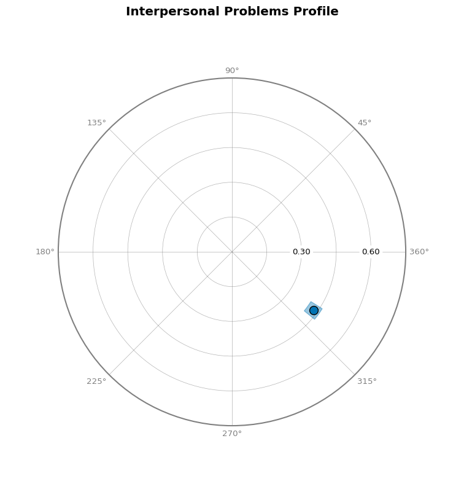

### Curve Plot

``` python
# Create curve plot showing observed scores and fitted curve
fig = results.plot_curve()
```


## 4. Correlation-Based SSM Analysis

To examine how personality disorder symptoms relate to interpersonal
problems, we can perform correlation-based SSM analysis by specifying
external measures.

``` python
# Analyze narcissistic personality disorder symptoms
results_corr = ssm_analyze(
    data=jz2017,
    scales=scales,
    angles=angles,
    measures="NARPD",
)

results_corr.summary()
```

<pre style="white-space:pre;overflow-x:auto;line-height:normal;font-family:Menlo,'DejaVu Sans Mono',consolas,'Courier New',monospace">Statistical Basis:   Correlation Scores
Bootstrap Resamples: <span style="color: #008080; text-decoration-color: #008080; font-weight: bold">2000</span>
Confidence Level:    <span style="color: #008080; text-decoration-color: #008080; font-weight: bold">0.95</span>
Listwise Deletion:   <span style="color: #00ff00; text-decoration-color: #00ff00; font-style: italic">True</span>
Scale Displacements: <span style="font-weight: bold">[</span><span style="color: #008080; text-decoration-color: #008080; font-weight: bold">90.0</span>, <span style="color: #008080; text-decoration-color: #008080; font-weight: bold">135.0</span>, <span style="color: #008080; text-decoration-color: #008080; font-weight: bold">180.0</span>, <span style="color: #008080; text-decoration-color: #008080; font-weight: bold">225.0</span>, <span style="color: #008080; text-decoration-color: #008080; font-weight: bold">270.0</span>, <span style="color: #008080; text-decoration-color: #008080; font-weight: bold">315.0</span>, <span style="color: #008080; text-decoration-color: #008080; font-weight: bold">360.0</span>, <span style="color: #008080; text-decoration-color: #008080; font-weight: bold">45.0</span><span style="font-weight: bold">]</span>


<span style="font-style: italic">                 Profile[NARPD]                  </span>
┏━━━━━━━━━━━━━━┳━━━━━━━━━━┳━━━━━━━━━━┳━━━━━━━━━━┓
┃<span style="font-weight: bold">              </span>┃<span style="font-weight: bold"> Estimate </span>┃<span style="font-weight: bold"> Lower CI </span>┃<span style="font-weight: bold"> Upper CI </span>┃
┡━━━━━━━━━━━━━━╇━━━━━━━━━━╇━━━━━━━━━━╇━━━━━━━━━━┩
│ Elevation    │ 0.202    │ 0.167    │ 0.237    │
│ X-Value      │ -0.062   │ -0.094   │ -0.029   │
│ Y-Value      │ 0.179    │ 0.145    │ 0.212    │
│ Amplitude    │ 0.189    │ 0.155    │ 0.224    │
│ Displacement │ 108.967  │ 99.221   │ 118.54   │
│ Model Fit    │ 0.957    │          │          │
└──────────────┴──────────┴──────────┴──────────┘
</pre>

``` python
# Visualize correlation-based results
fig = results_corr.plot_circle(title="NARPD Correlations")
```

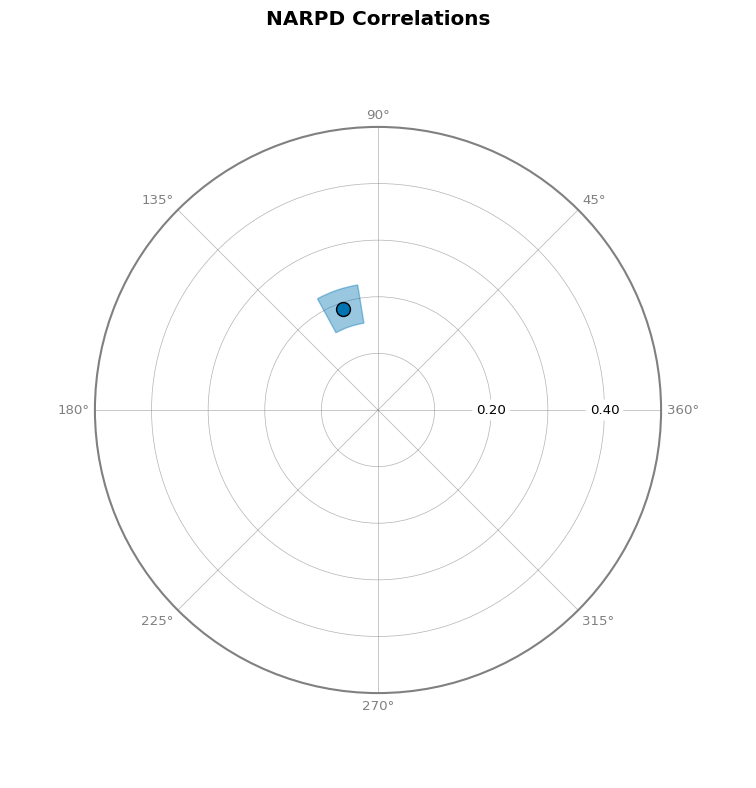

## 5. Group Comparisons

### Multiple Groups

``` python
# Analyze by gender
results_group = ssm_analyze(
    data=jz2017,
    scales=scales,
    angles=angles,
    grouping="Gender",
)

results_group.summary()
```

<pre style="white-space:pre;overflow-x:auto;line-height:normal;font-family:Menlo,'DejaVu Sans Mono',consolas,'Courier New',monospace">Statistical Basis:   Mean Scores
Bootstrap Resamples: <span style="color: #008080; text-decoration-color: #008080; font-weight: bold">2000</span>
Confidence Level:    <span style="color: #008080; text-decoration-color: #008080; font-weight: bold">0.95</span>
Listwise Deletion:   <span style="color: #00ff00; text-decoration-color: #00ff00; font-style: italic">True</span>
Scale Displacements: <span style="font-weight: bold">[</span><span style="color: #008080; text-decoration-color: #008080; font-weight: bold">90.0</span>, <span style="color: #008080; text-decoration-color: #008080; font-weight: bold">135.0</span>, <span style="color: #008080; text-decoration-color: #008080; font-weight: bold">180.0</span>, <span style="color: #008080; text-decoration-color: #008080; font-weight: bold">225.0</span>, <span style="color: #008080; text-decoration-color: #008080; font-weight: bold">270.0</span>, <span style="color: #008080; text-decoration-color: #008080; font-weight: bold">315.0</span>, <span style="color: #008080; text-decoration-color: #008080; font-weight: bold">360.0</span>, <span style="color: #008080; text-decoration-color: #008080; font-weight: bold">45.0</span><span style="font-weight: bold">]</span>


<span style="font-style: italic">                 Profile[Female]                 </span>
┏━━━━━━━━━━━━━━┳━━━━━━━━━━┳━━━━━━━━━━┳━━━━━━━━━━┓
┃<span style="font-weight: bold">              </span>┃<span style="font-weight: bold"> Estimate </span>┃<span style="font-weight: bold"> Lower CI </span>┃<span style="font-weight: bold"> Upper CI </span>┃
┡━━━━━━━━━━━━━━╇━━━━━━━━━━╇━━━━━━━━━━╇━━━━━━━━━━┩
│ Elevation    │ 0.946    │ 0.908    │ 0.984    │
│ X-Value      │ 0.459    │ 0.421    │ 0.497    │
│ Y-Value      │ -0.31    │ -0.356   │ -0.268   │
│ Amplitude    │ 0.554    │ 0.511    │ 0.599    │
│ Displacement │ 325.963  │ 321.939  │ 329.811  │
│ Model Fit    │ 0.889    │          │          │
└──────────────┴──────────┴──────────┴──────────┘
<span style="font-style: italic">                  Profile[Male]                  </span>
┏━━━━━━━━━━━━━━┳━━━━━━━━━━┳━━━━━━━━━━┳━━━━━━━━━━┓
┃<span style="font-weight: bold">              </span>┃<span style="font-weight: bold"> Estimate </span>┃<span style="font-weight: bold"> Lower CI </span>┃<span style="font-weight: bold"> Upper CI </span>┃
┡━━━━━━━━━━━━━━╇━━━━━━━━━━╇━━━━━━━━━━╇━━━━━━━━━━┩
│ Elevation    │ 0.884    │ 0.842    │ 0.926    │
│ X-Value      │ 0.227    │ 0.192    │ 0.261    │
│ Y-Value      │ -0.186   │ -0.225   │ -0.148   │
│ Amplitude    │ 0.294    │ 0.258    │ 0.33     │
│ Displacement │ 320.685  │ 313.649  │ 328.014  │
│ Model Fit    │ 0.824    │          │          │
└──────────────┴──────────┴──────────┴──────────┘
</pre>

``` python
# Compare groups on circle plot
fig = results_group.plot_circle(colors="Set2", title="Interpersonal Problems by Gender")
```

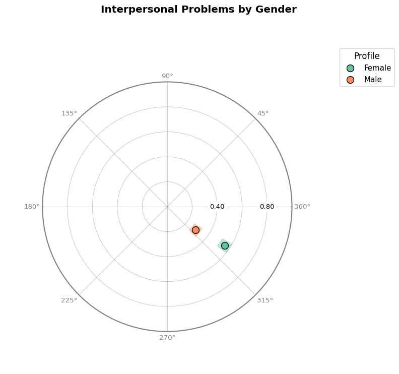

``` python
# Compare groups with curve plots
fig = results_group.plot_curve(angle_labels=scales)
```

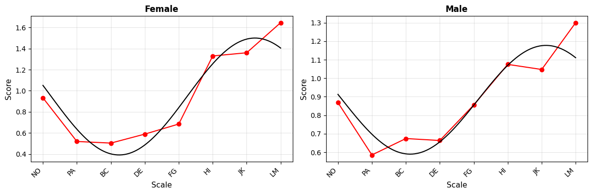

### Multiple Measures

``` python
# Compare multiple personality disorder symptoms
results_multi = ssm_analyze(
    data=jz2017,
    scales=scales,
    angles=angles,
    measures=["NARPD", "ASPD", "BORPD"],
)

results_multi.summary()
```

<pre style="white-space:pre;overflow-x:auto;line-height:normal;font-family:Menlo,'DejaVu Sans Mono',consolas,'Courier New',monospace">Statistical Basis:   Correlation Scores
Bootstrap Resamples: <span style="color: #008080; text-decoration-color: #008080; font-weight: bold">2000</span>
Confidence Level:    <span style="color: #008080; text-decoration-color: #008080; font-weight: bold">0.95</span>
Listwise Deletion:   <span style="color: #00ff00; text-decoration-color: #00ff00; font-style: italic">True</span>
Scale Displacements: <span style="font-weight: bold">[</span><span style="color: #008080; text-decoration-color: #008080; font-weight: bold">90.0</span>, <span style="color: #008080; text-decoration-color: #008080; font-weight: bold">135.0</span>, <span style="color: #008080; text-decoration-color: #008080; font-weight: bold">180.0</span>, <span style="color: #008080; text-decoration-color: #008080; font-weight: bold">225.0</span>, <span style="color: #008080; text-decoration-color: #008080; font-weight: bold">270.0</span>, <span style="color: #008080; text-decoration-color: #008080; font-weight: bold">315.0</span>, <span style="color: #008080; text-decoration-color: #008080; font-weight: bold">360.0</span>, <span style="color: #008080; text-decoration-color: #008080; font-weight: bold">45.0</span><span style="font-weight: bold">]</span>


<span style="font-style: italic">                 Profile[NARPD]                  </span>
┏━━━━━━━━━━━━━━┳━━━━━━━━━━┳━━━━━━━━━━┳━━━━━━━━━━┓
┃<span style="font-weight: bold">              </span>┃<span style="font-weight: bold"> Estimate </span>┃<span style="font-weight: bold"> Lower CI </span>┃<span style="font-weight: bold"> Upper CI </span>┃
┡━━━━━━━━━━━━━━╇━━━━━━━━━━╇━━━━━━━━━━╇━━━━━━━━━━┩
│ Elevation    │ 0.202    │ 0.168    │ 0.238    │
│ X-Value      │ -0.062   │ -0.094   │ -0.03    │
│ Y-Value      │ 0.179    │ 0.143    │ 0.211    │
│ Amplitude    │ 0.189    │ 0.154    │ 0.223    │
│ Displacement │ 108.967  │ 99.472   │ 118.732  │
│ Model Fit    │ 0.957    │          │          │
└──────────────┴──────────┴──────────┴──────────┘
<span style="font-style: italic">                  Profile[ASPD]                  </span>
┏━━━━━━━━━━━━━━┳━━━━━━━━━━┳━━━━━━━━━━┳━━━━━━━━━━┓
┃<span style="font-weight: bold">              </span>┃<span style="font-weight: bold"> Estimate </span>┃<span style="font-weight: bold"> Lower CI </span>┃<span style="font-weight: bold"> Upper CI </span>┃
┡━━━━━━━━━━━━━━╇━━━━━━━━━━╇━━━━━━━━━━╇━━━━━━━━━━┩
│ Elevation    │ 0.124    │ 0.089    │ 0.159    │
│ X-Value      │ -0.099   │ -0.133   │ -0.062   │
│ Y-Value      │ 0.203    │ 0.168    │ 0.237    │
│ Amplitude    │ 0.226    │ 0.191    │ 0.262    │
│ Displacement │ 115.927  │ 106.85   │ 124.367  │
│ Model Fit    │ 0.964    │          │          │
└──────────────┴──────────┴──────────┴──────────┘
<span style="font-style: italic">                 Profile[BORPD]                  </span>
┏━━━━━━━━━━━━━━┳━━━━━━━━━━┳━━━━━━━━━━┳━━━━━━━━━━┓
┃<span style="font-weight: bold">              </span>┃<span style="font-weight: bold"> Estimate </span>┃<span style="font-weight: bold"> Lower CI </span>┃<span style="font-weight: bold"> Upper CI </span>┃
┡━━━━━━━━━━━━━━╇━━━━━━━━━━╇━━━━━━━━━━╇━━━━━━━━━━┩
│ Elevation    │ 0.277    │ 0.243    │ 0.31     │
│ X-Value      │ -0.036   │ -0.069   │ -0.004   │
│ Y-Value      │ 0.097    │ 0.056    │ 0.138    │
│ Amplitude    │ 0.103    │ 0.064    │ 0.146    │
│ Displacement │ 110.358  │ 92.848   │ 130.012  │
│ Model Fit    │ 0.872    │          │          │
└──────────────┴──────────┴──────────┴──────────┘
</pre>

``` python
# Visualize multiple measures
fig = results_multi.plot_circle(
    colors=["red", "blue", "green"], title="Personality Disorder Symptoms"
)
```

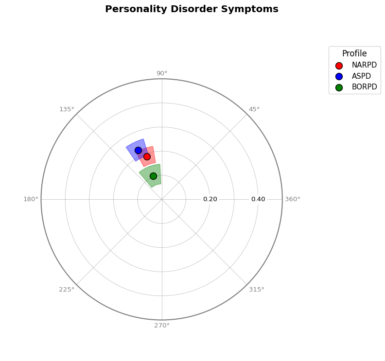

## 6. Contrast Analyses

### Group Contrasts

To test whether groups differ significantly on SSM parameters, use
`contrast=True`:

``` python
# Contrast analysis between genders
results_contrast = ssm_analyze(
    data=jz2017,
    scales=scales,
    angles=angles,
    grouping="Gender",
    contrast=True,
)

results_contrast.summary()
```

<pre style="white-space:pre;overflow-x:auto;line-height:normal;font-family:Menlo,'DejaVu Sans Mono',consolas,'Courier New',monospace">Statistical Basis:   Mean Scores
Bootstrap Resamples: <span style="color: #008080; text-decoration-color: #008080; font-weight: bold">2000</span>
Confidence Level:    <span style="color: #008080; text-decoration-color: #008080; font-weight: bold">0.95</span>
Listwise Deletion:   <span style="color: #00ff00; text-decoration-color: #00ff00; font-style: italic">True</span>
Scale Displacements: <span style="font-weight: bold">[</span><span style="color: #008080; text-decoration-color: #008080; font-weight: bold">90.0</span>, <span style="color: #008080; text-decoration-color: #008080; font-weight: bold">135.0</span>, <span style="color: #008080; text-decoration-color: #008080; font-weight: bold">180.0</span>, <span style="color: #008080; text-decoration-color: #008080; font-weight: bold">225.0</span>, <span style="color: #008080; text-decoration-color: #008080; font-weight: bold">270.0</span>, <span style="color: #008080; text-decoration-color: #008080; font-weight: bold">315.0</span>, <span style="color: #008080; text-decoration-color: #008080; font-weight: bold">360.0</span>, <span style="color: #008080; text-decoration-color: #008080; font-weight: bold">45.0</span><span style="font-weight: bold">]</span>


<span style="font-style: italic">                 Profile[Female]                 </span>
┏━━━━━━━━━━━━━━┳━━━━━━━━━━┳━━━━━━━━━━┳━━━━━━━━━━┓
┃<span style="font-weight: bold">              </span>┃<span style="font-weight: bold"> Estimate </span>┃<span style="font-weight: bold"> Lower CI </span>┃<span style="font-weight: bold"> Upper CI </span>┃
┡━━━━━━━━━━━━━━╇━━━━━━━━━━╇━━━━━━━━━━╇━━━━━━━━━━┩
│ Elevation    │ 0.946    │ 0.906    │ 0.983    │
│ X-Value      │ 0.459    │ 0.422    │ 0.496    │
│ Y-Value      │ -0.31    │ -0.352   │ -0.267   │
│ Amplitude    │ 0.554    │ 0.512    │ 0.599    │
│ Displacement │ 325.963  │ 322.128  │ 329.684  │
│ Model Fit    │ 0.889    │          │          │
└──────────────┴──────────┴──────────┴──────────┘
<span style="font-style: italic">                  Profile[Male]                  </span>
┏━━━━━━━━━━━━━━┳━━━━━━━━━━┳━━━━━━━━━━┳━━━━━━━━━━┓
┃<span style="font-weight: bold">              </span>┃<span style="font-weight: bold"> Estimate </span>┃<span style="font-weight: bold"> Lower CI </span>┃<span style="font-weight: bold"> Upper CI </span>┃
┡━━━━━━━━━━━━━━╇━━━━━━━━━━╇━━━━━━━━━━╇━━━━━━━━━━┩
│ Elevation    │ 0.884    │ 0.842    │ 0.927    │
│ X-Value      │ 0.227    │ 0.191    │ 0.263    │
│ Y-Value      │ -0.186   │ -0.223   │ -0.147   │
│ Amplitude    │ 0.294    │ 0.258    │ 0.33     │
│ Displacement │ 320.685  │ 313.831  │ 327.899  │
│ Model Fit    │ 0.824    │          │          │
└──────────────┴──────────┴──────────┴──────────┘
<span style="font-style: italic">             Profile[Male - Female]              </span>
┏━━━━━━━━━━━━━━┳━━━━━━━━━━┳━━━━━━━━━━┳━━━━━━━━━━┓
┃<span style="font-weight: bold">              </span>┃<span style="font-weight: bold"> Estimate </span>┃<span style="font-weight: bold"> Lower CI </span>┃<span style="font-weight: bold"> Upper CI </span>┃
┡━━━━━━━━━━━━━━╇━━━━━━━━━━╇━━━━━━━━━━╇━━━━━━━━━━┩
│ Elevation    │ -0.062   │ -0.118   │ -0.004   │
│ X-Value      │ -0.232   │ -0.282   │ -0.18    │
│ Y-Value      │ 0.124    │ 0.068    │ 0.18     │
│ Amplitude    │ -0.261   │ -0.317   │ -0.203   │
│ Displacement │ -5.278   │ 347.143  │ 2.851    │
│ Model Fit    │ -0.066   │          │          │
└──────────────┴──────────┴──────────┴──────────┘
</pre>

``` python
# View contrast results (last row shows Male - Female differences)
GT(results_contrast.results.round(2))
```

<div id="eqirjcroyd" style="padding-left:0px;padding-right:0px;padding-top:10px;padding-bottom:10px;overflow-x:auto;overflow-y:auto;width:auto;height:auto;">
<style>
#eqirjcroyd table {
          font-family: -apple-system, BlinkMacSystemFont, 'Segoe UI', Roboto, Oxygen, Ubuntu, Cantarell, 'Helvetica Neue', 'Fira Sans', 'Droid Sans', Arial, sans-serif;
          -webkit-font-smoothing: antialiased;
          -moz-osx-font-smoothing: grayscale;
        }

#eqirjcroyd thead, tbody, tfoot, tr, td, th { border-style: none !important; }
 tr { background-color: transparent !important; }
#eqirjcroyd p { margin: 0 !important; padding: 0 !important; }
 #eqirjcroyd .gt_table { display: table !important; border-collapse: collapse !important; line-height: normal !important; margin-left: auto !important; margin-right: auto !important; color: #333333 !important; font-size: 16px !important; font-weight: normal !important; font-style: normal !important; background-color: #FFFFFF !important; width: auto !important; border-top-style: solid !important; border-top-width: 2px !important; border-top-color: #A8A8A8 !important; border-right-style: none !important; border-right-width: 2px !important; border-right-color: #D3D3D3 !important; border-bottom-style: solid !important; border-bottom-width: 2px !important; border-bottom-color: #A8A8A8 !important; border-left-style: none !important; border-left-width: 2px !important; border-left-color: #D3D3D3 !important; }
 #eqirjcroyd .gt_caption { padding-top: 4px !important; padding-bottom: 4px !important; }
 #eqirjcroyd .gt_title { color: #333333 !important; font-size: 125% !important; font-weight: initial !important; padding-top: 4px !important; padding-bottom: 4px !important; padding-left: 5px !important; padding-right: 5px !important; border-bottom-color: #FFFFFF !important; border-bottom-width: 0 !important; }
 #eqirjcroyd .gt_subtitle { color: #333333 !important; font-size: 85% !important; font-weight: initial !important; padding-top: 3px !important; padding-bottom: 5px !important; padding-left: 5px !important; padding-right: 5px !important; border-top-color: #FFFFFF !important; border-top-width: 0 !important; }
 #eqirjcroyd .gt_heading { background-color: #FFFFFF !important; text-align: center !important; border-bottom-color: #FFFFFF !important; border-left-style: none !important; border-left-width: 1px !important; border-left-color: #D3D3D3 !important; border-right-style: none !important; border-right-width: 1px !important; border-right-color: #D3D3D3 !important; }
 #eqirjcroyd .gt_bottom_border { border-bottom-style: solid !important; border-bottom-width: 2px !important; border-bottom-color: #D3D3D3 !important; }
 #eqirjcroyd .gt_col_headings { border-top-style: solid !important; border-top-width: 2px !important; border-top-color: #D3D3D3 !important; border-bottom-style: solid !important; border-bottom-width: 2px !important; border-bottom-color: #D3D3D3 !important; border-left-style: none !important; border-left-width: 1px !important; border-left-color: #D3D3D3 !important; border-right-style: none !important; border-right-width: 1px !important; border-right-color: #D3D3D3 !important; }
 #eqirjcroyd .gt_col_heading { color: #333333 !important; background-color: #FFFFFF !important; font-size: 100% !important; font-weight: normal !important; text-transform: inherit !important; border-left-style: none !important; border-left-width: 1px !important; border-left-color: #D3D3D3 !important; border-right-style: none !important; border-right-width: 1px !important; border-right-color: #D3D3D3 !important; vertical-align: bottom !important; padding-top: 5px !important; padding-bottom: 5px !important; padding-left: 5px !important; padding-right: 5px !important; overflow-x: hidden !important; }
 #eqirjcroyd .gt_column_spanner_outer { color: #333333 !important; background-color: #FFFFFF !important; font-size: 100% !important; font-weight: normal !important; text-transform: inherit !important; padding-top: 0 !important; padding-bottom: 0 !important; padding-left: 4px !important; padding-right: 4px !important; }
 #eqirjcroyd .gt_column_spanner_outer:first-child { padding-left: 0 !important; }
 #eqirjcroyd .gt_column_spanner_outer:last-child { padding-right: 0 !important; }
 #eqirjcroyd .gt_column_spanner { border-bottom-style: solid !important; border-bottom-width: 2px !important; border-bottom-color: #D3D3D3 !important; vertical-align: bottom !important; padding-top: 5px !important; padding-bottom: 5px !important; overflow-x: hidden !important; display: inline-block !important; width: 100% !important; }
 #eqirjcroyd .gt_spanner_row { border-bottom-style: hidden !important; }
 #eqirjcroyd .gt_group_heading { padding-top: 8px !important; padding-bottom: 8px !important; padding-left: 5px !important; padding-right: 5px !important; color: #333333 !important; background-color: #FFFFFF !important; font-size: 100% !important; font-weight: initial !important; text-transform: inherit !important; border-top-style: solid !important; border-top-width: 2px !important; border-top-color: #D3D3D3 !important; border-bottom-style: solid !important; border-bottom-width: 2px !important; border-bottom-color: #D3D3D3 !important; border-left-style: none !important; border-left-width: 1px !important; border-left-color: #D3D3D3 !important; border-right-style: none !important; border-right-width: 1px !important; border-right-color: #D3D3D3 !important; vertical-align: middle !important; text-align: left !important; }
 #eqirjcroyd .gt_empty_group_heading { padding: 0.5px !important; color: #333333 !important; background-color: #FFFFFF !important; font-size: 100% !important; font-weight: initial !important; border-top-style: solid !important; border-top-width: 2px !important; border-top-color: #D3D3D3 !important; border-bottom-style: solid !important; border-bottom-width: 2px !important; border-bottom-color: #D3D3D3 !important; vertical-align: middle !important; }
 #eqirjcroyd .gt_from_md> :first-child { margin-top: 0 !important; }
 #eqirjcroyd .gt_from_md> :last-child { margin-bottom: 0 !important; }
 #eqirjcroyd .gt_row { padding-top: 8px !important; padding-bottom: 8px !important; padding-left: 5px !important; padding-right: 5px !important; margin: 10px !important; border-top-style: solid !important; border-top-width: 1px !important; border-top-color: #D3D3D3 !important; border-left-style: none !important; border-left-width: 1px !important; border-left-color: #D3D3D3 !important; border-right-style: none !important; border-right-width: 1px !important; border-right-color: #D3D3D3 !important; vertical-align: middle !important; overflow-x: hidden !important; }
 #eqirjcroyd .gt_stub { color: #333333 !important; background-color: #FFFFFF !important; font-size: 100% !important; font-weight: initial !important; text-transform: inherit !important; border-right-style: solid !important; border-right-width: 2px !important; border-right-color: #D3D3D3 !important; padding-left: 5px !important; padding-right: 5px !important; }
 #eqirjcroyd .gt_stub_row_group { color: #333333 !important; background-color: #FFFFFF !important; font-size: 100% !important; font-weight: initial !important; text-transform: inherit !important; border-right-style: solid !important; border-right-width: 2px !important; border-right-color: #D3D3D3 !important; padding-left: 5px !important; padding-right: 5px !important; vertical-align: top !important; }
 #eqirjcroyd .gt_row_group_first td { border-top-width: 2px !important; }
 #eqirjcroyd .gt_row_group_first th { border-top-width: 2px !important; }
 #eqirjcroyd .gt_striped { color: #333333 !important; background-color: #F4F4F4 !important; }
 #eqirjcroyd .gt_table_body { border-top-style: solid !important; border-top-width: 2px !important; border-top-color: #D3D3D3 !important; border-bottom-style: solid !important; border-bottom-width: 2px !important; border-bottom-color: #D3D3D3 !important; }
 #eqirjcroyd .gt_grand_summary_row { color: #333333 !important; background-color: #FFFFFF !important; text-transform: inherit !important; padding-top: 8px !important; padding-bottom: 8px !important; padding-left: 5px !important; padding-right: 5px !important; }
 #eqirjcroyd .gt_first_grand_summary_row_bottom { border-top-style: double !important; border-top-width: 6px !important; border-top-color: #D3D3D3 !important; }
 #eqirjcroyd .gt_last_grand_summary_row_top { border-bottom-style: double !important; border-bottom-width: 6px !important; border-bottom-color: #D3D3D3 !important; }
 #eqirjcroyd .gt_sourcenotes { color: #333333 !important; background-color: #FFFFFF !important; border-bottom-style: none !important; border-bottom-width: 2px !important; border-bottom-color: #D3D3D3 !important; border-left-style: none !important; border-left-width: 2px !important; border-left-color: #D3D3D3 !important; border-right-style: none !important; border-right-width: 2px !important; border-right-color: #D3D3D3 !important; }
 #eqirjcroyd .gt_sourcenote { font-size: 90% !important; padding-top: 4px !important; padding-bottom: 4px !important; padding-left: 5px !important; padding-right: 5px !important; text-align: left !important; }
 #eqirjcroyd .gt_left { text-align: left !important; }
 #eqirjcroyd .gt_center { text-align: center !important; }
 #eqirjcroyd .gt_right { text-align: right !important; font-variant-numeric: tabular-nums !important; }
 #eqirjcroyd .gt_font_normal { font-weight: normal !important; }
 #eqirjcroyd .gt_font_bold { font-weight: bold !important; }
 #eqirjcroyd .gt_font_italic { font-style: italic !important; }
 #eqirjcroyd .gt_super { font-size: 65% !important; }
 #eqirjcroyd .gt_footnote_marks { font-size: 75% !important; vertical-align: 0.4em !important; position: initial !important; }
 #eqirjcroyd .gt_asterisk { font-size: 100% !important; vertical-align: 0 !important; }

</style>

<table class="gt_table" data-quarto-postprocess="true"
data-quarto-disable-processing="false" data-quarto-bootstrap="false">
<thead>
<tr class="gt_col_headings">
<th id="Label" class="gt_col_heading gt_columns_bottom_border gt_left"
data-quarto-table-cell-role="th" scope="col">Label</th>
<th id="Group" class="gt_col_heading gt_columns_bottom_border gt_left"
data-quarto-table-cell-role="th" scope="col">Group</th>
<th id="Measure"
class="gt_col_heading gt_columns_bottom_border gt_right"
data-quarto-table-cell-role="th" scope="col">Measure</th>
<th id="e_est" class="gt_col_heading gt_columns_bottom_border gt_right"
data-quarto-table-cell-role="th" scope="col">e_est</th>
<th id="e_lci" class="gt_col_heading gt_columns_bottom_border gt_right"
data-quarto-table-cell-role="th" scope="col">e_lci</th>
<th id="e_uci" class="gt_col_heading gt_columns_bottom_border gt_right"
data-quarto-table-cell-role="th" scope="col">e_uci</th>
<th id="x_est" class="gt_col_heading gt_columns_bottom_border gt_right"
data-quarto-table-cell-role="th" scope="col">x_est</th>
<th id="x_lci" class="gt_col_heading gt_columns_bottom_border gt_right"
data-quarto-table-cell-role="th" scope="col">x_lci</th>
<th id="x_uci" class="gt_col_heading gt_columns_bottom_border gt_right"
data-quarto-table-cell-role="th" scope="col">x_uci</th>
<th id="y_est" class="gt_col_heading gt_columns_bottom_border gt_right"
data-quarto-table-cell-role="th" scope="col">y_est</th>
<th id="y_lci" class="gt_col_heading gt_columns_bottom_border gt_right"
data-quarto-table-cell-role="th" scope="col">y_lci</th>
<th id="y_uci" class="gt_col_heading gt_columns_bottom_border gt_right"
data-quarto-table-cell-role="th" scope="col">y_uci</th>
<th id="a_est" class="gt_col_heading gt_columns_bottom_border gt_right"
data-quarto-table-cell-role="th" scope="col">a_est</th>
<th id="a_lci" class="gt_col_heading gt_columns_bottom_border gt_right"
data-quarto-table-cell-role="th" scope="col">a_lci</th>
<th id="a_uci" class="gt_col_heading gt_columns_bottom_border gt_right"
data-quarto-table-cell-role="th" scope="col">a_uci</th>
<th id="d_est" class="gt_col_heading gt_columns_bottom_border gt_right"
data-quarto-table-cell-role="th" scope="col">d_est</th>
<th id="d_lci" class="gt_col_heading gt_columns_bottom_border gt_right"
data-quarto-table-cell-role="th" scope="col">d_lci</th>
<th id="d_uci" class="gt_col_heading gt_columns_bottom_border gt_right"
data-quarto-table-cell-role="th" scope="col">d_uci</th>
<th id="fit_est"
class="gt_col_heading gt_columns_bottom_border gt_right"
data-quarto-table-cell-role="th" scope="col">fit_est</th>
</tr>
</thead>
<tbody class="gt_table_body">
<tr>
<td class="gt_row gt_left">Female</td>
<td class="gt_row gt_left">Female</td>
<td class="gt_row gt_right"><na></td>
<td class="gt_row gt_right">0.95</td>
<td class="gt_row gt_right">0.91</td>
<td class="gt_row gt_right">0.98</td>
<td class="gt_row gt_right">0.46</td>
<td class="gt_row gt_right">0.42</td>
<td class="gt_row gt_right">0.5</td>
<td class="gt_row gt_right">-0.31</td>
<td class="gt_row gt_right">-0.35</td>
<td class="gt_row gt_right">-0.27</td>
<td class="gt_row gt_right">0.55</td>
<td class="gt_row gt_right">0.51</td>
<td class="gt_row gt_right">0.6</td>
<td class="gt_row gt_right">325.96</td>
<td class="gt_row gt_right">322.13</td>
<td class="gt_row gt_right">329.68</td>
<td class="gt_row gt_right">0.89</td>
</tr>
<tr>
<td class="gt_row gt_left">Male</td>
<td class="gt_row gt_left">Male</td>
<td class="gt_row gt_right"><na></td>
<td class="gt_row gt_right">0.88</td>
<td class="gt_row gt_right">0.84</td>
<td class="gt_row gt_right">0.93</td>
<td class="gt_row gt_right">0.23</td>
<td class="gt_row gt_right">0.19</td>
<td class="gt_row gt_right">0.26</td>
<td class="gt_row gt_right">-0.19</td>
<td class="gt_row gt_right">-0.22</td>
<td class="gt_row gt_right">-0.15</td>
<td class="gt_row gt_right">0.29</td>
<td class="gt_row gt_right">0.26</td>
<td class="gt_row gt_right">0.33</td>
<td class="gt_row gt_right">320.68</td>
<td class="gt_row gt_right">313.83</td>
<td class="gt_row gt_right">327.9</td>
<td class="gt_row gt_right">0.82</td>
</tr>
<tr>
<td class="gt_row gt_left">Male - Female</td>
<td class="gt_row gt_left">Male - Female</td>
<td class="gt_row gt_right"><na></td>
<td class="gt_row gt_right">-0.06</td>
<td class="gt_row gt_right">-0.12</td>
<td class="gt_row gt_right">-0.0</td>
<td class="gt_row gt_right">-0.23</td>
<td class="gt_row gt_right">-0.28</td>
<td class="gt_row gt_right">-0.18</td>
<td class="gt_row gt_right">0.12</td>
<td class="gt_row gt_right">0.07</td>
<td class="gt_row gt_right">0.18</td>
<td class="gt_row gt_right">-0.26</td>
<td class="gt_row gt_right">-0.32</td>
<td class="gt_row gt_right">-0.2</td>
<td class="gt_row gt_right">-5.28</td>
<td class="gt_row gt_right">347.14</td>
<td class="gt_row gt_right">2.85</td>
<td class="gt_row gt_right">-0.07</td>
</tr>
</tbody>
</table>

</div>

``` python
# Visualize contrasts
fig = results_contrast.plot_contrast()
```

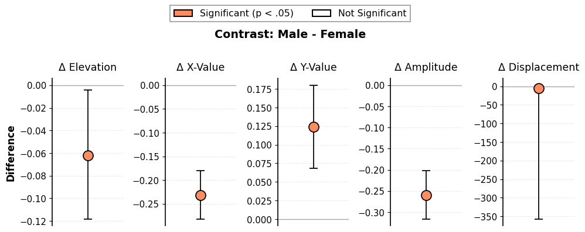

``` python
# Simplified contrast plot (drop X and Y parameters)
fig = results_contrast.plot_contrast(drop_xy=True)
```

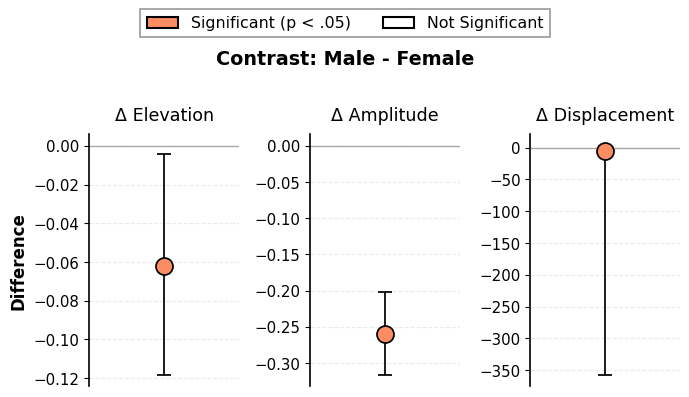

### Measure Contrasts

``` python
# Compare two measures
results_meas_contrast = ssm_analyze(
    data=jz2017,
    scales=scales,
    angles=angles,
    measures=["NARPD", "ASPD"],
    contrast=True,
)

results_meas_contrast.summary()
```

<pre style="white-space:pre;overflow-x:auto;line-height:normal;font-family:Menlo,'DejaVu Sans Mono',consolas,'Courier New',monospace">Statistical Basis:   Correlation Scores
Bootstrap Resamples: <span style="color: #008080; text-decoration-color: #008080; font-weight: bold">2000</span>
Confidence Level:    <span style="color: #008080; text-decoration-color: #008080; font-weight: bold">0.95</span>
Listwise Deletion:   <span style="color: #00ff00; text-decoration-color: #00ff00; font-style: italic">True</span>
Scale Displacements: <span style="font-weight: bold">[</span><span style="color: #008080; text-decoration-color: #008080; font-weight: bold">90.0</span>, <span style="color: #008080; text-decoration-color: #008080; font-weight: bold">135.0</span>, <span style="color: #008080; text-decoration-color: #008080; font-weight: bold">180.0</span>, <span style="color: #008080; text-decoration-color: #008080; font-weight: bold">225.0</span>, <span style="color: #008080; text-decoration-color: #008080; font-weight: bold">270.0</span>, <span style="color: #008080; text-decoration-color: #008080; font-weight: bold">315.0</span>, <span style="color: #008080; text-decoration-color: #008080; font-weight: bold">360.0</span>, <span style="color: #008080; text-decoration-color: #008080; font-weight: bold">45.0</span><span style="font-weight: bold">]</span>


<span style="font-style: italic">                 Profile[NARPD]                  </span>
┏━━━━━━━━━━━━━━┳━━━━━━━━━━┳━━━━━━━━━━┳━━━━━━━━━━┓
┃<span style="font-weight: bold">              </span>┃<span style="font-weight: bold"> Estimate </span>┃<span style="font-weight: bold"> Lower CI </span>┃<span style="font-weight: bold"> Upper CI </span>┃
┡━━━━━━━━━━━━━━╇━━━━━━━━━━╇━━━━━━━━━━╇━━━━━━━━━━┩
│ Elevation    │ 0.202    │ 0.169    │ 0.235    │
│ X-Value      │ -0.062   │ -0.094   │ -0.028   │
│ Y-Value      │ 0.179    │ 0.146    │ 0.212    │
│ Amplitude    │ 0.189    │ 0.156    │ 0.224    │
│ Displacement │ 108.967  │ 99.04    │ 118.521  │
│ Model Fit    │ 0.957    │          │          │
└──────────────┴──────────┴──────────┴──────────┘
<span style="font-style: italic">                  Profile[ASPD]                  </span>
┏━━━━━━━━━━━━━━┳━━━━━━━━━━┳━━━━━━━━━━┳━━━━━━━━━━┓
┃<span style="font-weight: bold">              </span>┃<span style="font-weight: bold"> Estimate </span>┃<span style="font-weight: bold"> Lower CI </span>┃<span style="font-weight: bold"> Upper CI </span>┃
┡━━━━━━━━━━━━━━╇━━━━━━━━━━╇━━━━━━━━━━╇━━━━━━━━━━┩
│ Elevation    │ 0.124    │ 0.088    │ 0.16     │
│ X-Value      │ -0.099   │ -0.135   │ -0.063   │
│ Y-Value      │ 0.203    │ 0.169    │ 0.238    │
│ Amplitude    │ 0.226    │ 0.19     │ 0.262    │
│ Displacement │ 115.927  │ 107.14   │ 124.123  │
│ Model Fit    │ 0.964    │          │          │
└──────────────┴──────────┴──────────┴──────────┘
<span style="font-style: italic">              Profile[ASPD - NARPD]              </span>
┏━━━━━━━━━━━━━━┳━━━━━━━━━━┳━━━━━━━━━━┳━━━━━━━━━━┓
┃<span style="font-weight: bold">              </span>┃<span style="font-weight: bold"> Estimate </span>┃<span style="font-weight: bold"> Lower CI </span>┃<span style="font-weight: bold"> Upper CI </span>┃
┡━━━━━━━━━━━━━━╇━━━━━━━━━━╇━━━━━━━━━━╇━━━━━━━━━━┩
│ Elevation    │ -0.079   │ -0.117   │ -0.04    │
│ X-Value      │ -0.037   │ -0.076   │ 0.001    │
│ Y-Value      │ 0.024    │ -0.012   │ 0.062    │
│ Amplitude    │ 0.037    │ -0.001   │ 0.077    │
│ Displacement │ 6.96     │ 356.639  │ 17.454   │
│ Model Fit    │ 0.007    │          │          │
└──────────────┴──────────┴──────────┴──────────┘
</pre>

``` python
# Visualize measure contrasts
fig = results_meas_contrast.plot_contrast()
```

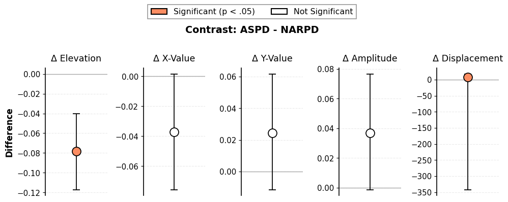

## 7. Customizing Visualizations

All plot functions support extensive customization:

``` python
# Circle plot with custom options
fig = results_group.plot_circle(
    colors="husl",  # Color palette
    fontsize=14,  # Font size
    figsize=(10, 10),  # Figure size
    title="Custom Circle Plot",
    angle_labels=scales,  # Custom angle labels
)
```

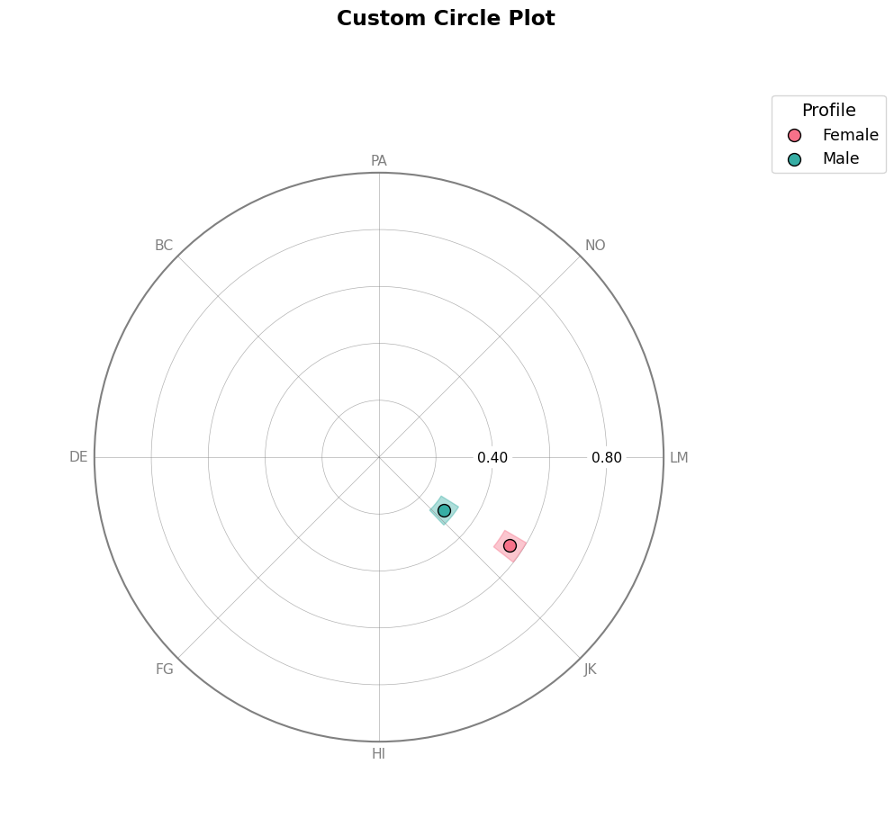

``` python
# Curve plot with custom options
fig = results_group.plot_curve(
    angle_labels=scales,
    base_size=12,
    figsize=(12, 5),
)
```

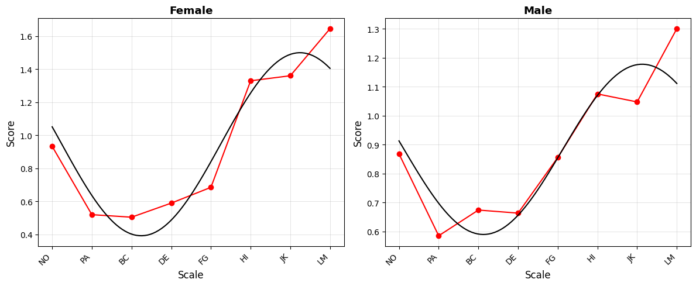

``` python
# Contrast plot with custom colors
fig = results_contrast.plot_contrast(
    sig_color="darkred",
    ns_color="lightgray",
    fontsize=14,
    drop_xy=True,
)
```

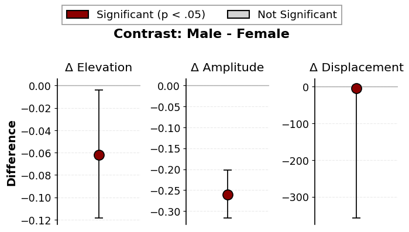

## 8. Saving Plots

All plots return matplotlib Figure objects that can be saved:

``` python
# Save plots
fig1 = results.plot_circle()
fig1.savefig("circle_plot.png", dpi=300, bbox_inches="tight")

fig2 = results.plot_curve()
fig2.savefig("curve_plot.png", dpi=300, bbox_inches="tight")
```

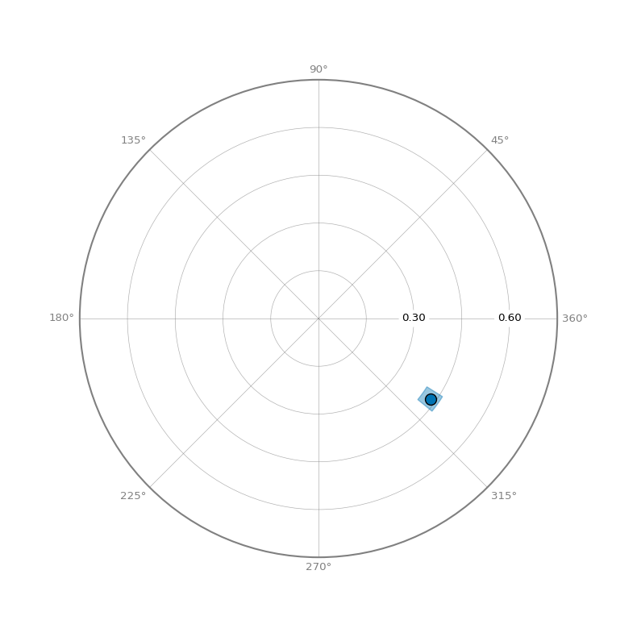

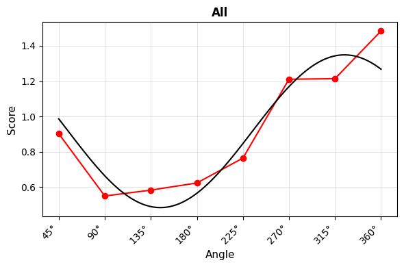

## Summary

The circumplex package provides a comprehensive toolkit for SSM
analysis:

-   **`ssm_analyze()`**: Performs mean-based or correlation-based SSM
    analysis
-   **`plot_circle()`**: Visualizes amplitude/displacement on circular
    plots
-   **`plot_curve()`**: Shows fitted curves with observed data
-   **`plot_contrast()`**: Displays parameter differences between groups

All functions support: - Single or multiple groups - Single or multiple
measures - Bootstrap confidence intervals - Contrast analyses -
Extensive customization options
